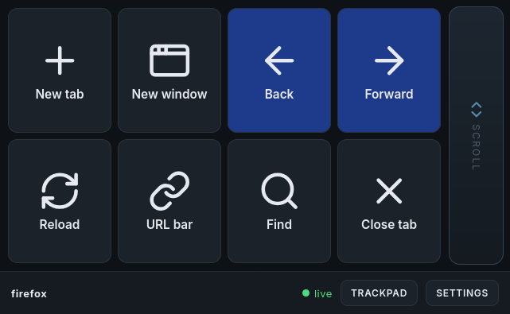

# deckd

App-aware touch control surface for your desktop. A Stream Deck-like deck of buttons, sliders, scroll strips, and a trackpad mode, rendered in any browser on any touchscreen device, driven by a local daemon that watches the focused application and swaps layouts automatically.

Not Linux-only: deckd runs on **GNOME** (Wayland), **KDE Plasma** (Wayland), any **X11** session, and **macOS** — each with its own focus watcher and input backend (see [Running deckd](#running-deckd)).



(deckd rendering a Firefox layout — buttons with icons and colors, plus the persistent scroll strip)

## Status

Pre-alpha, but the v1 milestone spine is landing. Both design-doc spikes are resolved and the T-series milestones through T8 are shipped:

- **uinput scroll end-to-end** (spike #1) — *done*
- **Focus watcher** (spike #2) — *done*
- **T1** pytest suite + domain docs — *done*
- **T2** keystroke injection — *done*
- **T3** D-Bus action primitive — *done*
- **T4** per-app layout switching from focus — *done*
- **T5** dev UX (auto-ignore + `deckctl layout` override) — *done*
- **T6** client chrome (bottom strip + persistent jogstrip) — *done*
- **T7** PWA manifest + orientation-safe chrome — *done*
- **T8** trackpad mode (cursor + tap + drag-lock) — *done*
- **T13** settings page (scroll + trackpad sliders, invert, localStorage) — *done*
- **T14** Screen Wake Lock (client stays awake while daemon is live) — *done*

What works today: focus a window on the desktop and the phone's browser flips to that app's layout automatically. Tap layout buttons to fire `shell`, `terminal`, `key`, or `dbus` actions. Drag the always-on right-side jogstrip to scroll the focused window through `REL_WHEEL_HI_RES`. Tap the chrome trackpad button and the phone becomes a mouse — drag to move the cursor, tap to click, two-finger tap to right-click, tap-and-a-half to drag. Edit any `layouts/*.yaml` file on the desktop and every connected client re-renders; a broken save shows an error diagnostic in place of the grid without killing the daemon. Buttons render with bundled icons (Lucide glyphs + Simple Icons brand logos, referenced as `icon: {source, name}`) and optional per-button background colours, and a **Content size** slider scales the deck for phone-vs-tablet readability.

```
                        ┌──────────┐
                        │  Phone / │
                        │  Tablet  │
                        │  Browser │
                        └────┬─────┘
                             │
                      WebSocket (ws://)
                             │
          ┌──────────────────┼───────────────────┐
          │             deckd daemon             │
          │            (aiohttp, asyncio)        │
          │                                      │
          │  ┌──────────┐  ┌──────────┐          │
          │  │  Layout  │  │  Action  │          │
          │  │  Loader  │  │ Dispatch │          │
          │  └──────────┘  └────┬─────┘          │
          │         │           │                │
          └─────────┼───────────┼────────────────┘
                    │           │
        layouts/*.yaml    ┌─────┴─────┬──────────┐
                          │           │          │
                      uinput       shell     D-Bus
                     (evdev)     (subprocess)  gdbus
                          │                    │
              scroll + keys + pointer  ┌───────┴───────┐
                          │            │               │
                     /dev/uinput   GNOME Shell     (xdotool —
                                   Extension        any X11 DE)
                                  deckd-focus
                                   @local

                            ┌──────────────────┐
                            │  Focus watchers  │
                            └──────────────────┘
                              GNOME Shell ext.   (Wayland, GNOME)
                              KWin script        (Wayland, KDE Plasma)
                              xdotool           (any X11 session)
                              osascript          (macOS)
```

## Layout

```
daemon/deckd/      Python daemon: aiohttp server, WebSocket, layout loader, action dispatch
client/            Vite + React + TS web client (the dumb renderer)
layouts/           Per-app YAML layouts (default.yaml + one per app)
scripts/smoke.py   End-to-end test that boots the daemon over WS, clicks every button
docs/INCEPTION.md  Full design doc — source of truth for *what* and *why*
```

## Running deckd

You need Python 3.11+ and Node 18+. Dependencies are managed with `[uv](https://docs.astral.sh/uv/)`:

```sh
# 1. Install uv (one-time)
curl -LsSf https://astral.sh/uv/install.sh | sh
export PATH="$HOME/.local/bin:$PATH"

# 2. Create the venv and install deps
uv venv --python 3.12
uv pip install -e ".[dev,uinput]"   # aarch64: source-builds python-evdev — see note below

# 3. Install JS client deps (once)
cd client && npm install && cd ..

# 4. Build the client so the daemon can serve it
just build-client

# 5. Run the daemon (serves the built client at http://127.0.0.1:8765)
just run-daemon
```

Open `http://127.0.0.1:8765` in any browser. You should see the active layout's buttons filling the main area, an always-on jogstrip pinned to the right edge, and a chrome bottom strip with the app name, a connection status dot, and a `trackpad` button. Drag or flick vertically on the right-side jogstrip to emit `REL_WHEEL_HI_RES` deltas through uinput (log-only when uinput is unavailable). Tap the `trackpad` button to swap the button grid for a full-area trackpad surface — see the [Trackpad mode](#trackpad-mode) section for the gesture list.

> **aarch64 Linux (e.g. Asahi):** `evdev-binary` publishes x86_64 wheels only, so it can't cover aarch64. Instead `just setup-linux` source-builds `python-evdev` via `scripts/install_evdev_source.sh` (the `uinput` extra also declares plain `evdev` on non-x86_64 via a `platform_machine` marker). The source build needs a C compiler and kernel headers — the flox dev env pins `gcc` for exactly this (Nix hides the headers from evdev's `build_ecodes`, so the script locates them via the compiler and passes them explicitly). With that plus `/dev/uinput` write access (see [uinput permissions](#uinput-permissions)), scroll/key/trackpad injection works natively on aarch64, **including KDE Plasma Wayland** — keys are injected at the kernel evdev layer, so the compositor routes them to the focused window. If the build is skipped the sink degrades gracefully to log-only.

### macOS

The daemon runs on macOS via `daemon/deckd/platform_macos.py` — focus + key injection work out of the box, and the jogstrip + trackpad need `pyobjc-framework-Quartz` (pulled in via the `[macos]` extra). The GNOME Shell focus extension is Linux-only.

Setup (no `uv`/uinput bits):

```sh
just setup            # auto-picks setup-macos on Mac, setup-linux elsewhere
just build-client
just dev-daemon       # listens on http://127.0.0.1:8765, auto-restarts on Python edits
```

`just dev-daemon` wraps the daemon in the `deckd-dev` supervisor so Python edits hot-reload (YAML hot-reloads either way). For a one-shot `deckd` invocation use `just run-daemon`.

To force a specific platform's setup (e.g. on a CI box): `just setup-linux` or `just setup-macos`.

First time you focus a non-default window, **System Events** will pop a TCC prompt asking you to allow the controlling terminal/iTerm/whatever wraps Python. Accept it once and the focus watcher runs forever after. The focus backend uses the process name as `app_id`, so layouts match by process name — `firefox`, `Terminal`, `kitty`, `code` etc. work as-is. The GNOME-specific per-app YAMLs (`org.gnome.Console`, `foot`, `konsole`…) won't match on macOS unless you rename them to the Mac process name.

What works / doesn't on macOS:

| capability                          | macOS                            |
| ----------------------------------- | -------------------------------- |
| focus detection                     | yes (osascript + System Events)  |
| `key:` action (printable + combos)  | yes (osascript `keystroke`)      |
| `key:` action (non-printable)       | partial (HID-code map covers the common ones — arrows, esc, tab, enter, F-keys) |
| `shell:` / `terminal:` actions      | yes                              |
| `dbus:` action                      | no (macOS D-Bus exists but GNOME services don't) |
| trackpad pointer + clicks + drag    | yes (PyObjC Quartz `CGEventCreateMouseEvent`) |
| jogstrip scroll                     | yes (PyObjC Quartz `CGEventCreateScrollWheelEvent` — pulled in via the `[macos]` extra) |

When the layout doesn't switch as expected, run `python scripts/check_focus_macos.py` for a one-shot diagnostic: it prints what `osascript` reports for the frontmost app, whether the auto-ignore rule would hold, and which layout `resolve_layout` would pick. Saves reading the daemon log for the common cases (TCC denied, stale daemon, wrong app_id).

### KDE Plasma Wayland

Two KDE-specific pieces on top of the base setup: a **KWin script** for focus-based layout switching, and **`/dev/uinput` access** so button/scroll/trackpad injection actually reaches apps. This walkthrough is distro-neutral; Nix/flox users get the extra CLI tools automatically (see the [Tooling note](#kde-plasma-wayland-sessions) under the focus watcher) and can skip the package-install hints.

**0. Check the KDE CLI tools are present.** These ship with a standard Plasma 6 desktop; run this to spot any gaps:

```sh
for t in kpackagetool6 kwriteconfig6 qdbus gdbus; do command -v "$t" >/dev/null || echo "missing: $t"; done
```

If something is missing, install it from your distro: `kpackagetool6`/`kwriteconfig6` come with **KDE Frameworks 6** (KPackage / KConfig tools), `qdbus` with **Qt 6 tools**, and `gdbus` with **glib** (Debian/Ubuntu `libglib2.0-bin`, Fedora `glib2`, Arch `glib2`). The daemon shells out to `gdbus` on every focus poll, so it's not optional.

**1. Install deps and build the client.**

```sh
just setup          # venv + Python/JS deps incl. the uinput sink (auto-picks setup-linux)
just build-client
```

On **x86_64** the `uinput` extra installs the prebuilt `evdev-binary` wheel. On **aarch64** (e.g. Asahi) there is no such wheel, so `just setup-linux` source-builds `python-evdev` instead — that needs a C compiler and kernel headers:

```sh
# Debian/Ubuntu
sudo apt install build-essential linux-libc-dev
# Fedora
sudo dnf install gcc kernel-headers
# Arch
sudo pacman -S base-devel linux-api-headers
```

**2. Grant `/dev/uinput` write access.** Without it, keys/scroll/trackpad are silently no-ops (the daemon logs `platform sink unavailable` at startup). Follow [uinput permissions](#uinput-permissions) — the udev rule plus adding yourself to the `input` group, then log out and back in. `just check-uinput` confirms it.

**3. Run the daemon**, then install the focus KWin script:

```sh
just run-daemon                 # owns org.deckd.Focus; serves the client at :8765
just install-focus-kwin         # installs + enables + hot-starts the KWin focus script
```

Order matters slightly: the script pushes focus to the *running* daemon, so start the daemon first (or just re-run `install-focus-kwin` afterwards — see [Cold-start ordering](#kde-plasma-wayland-sessions)). Details and verification are in [KDE Plasma Wayland sessions](#kde-plasma-wayland-sessions) under the focus watcher.

**4. Verify.** Open `http://127.0.0.1:8765`, focus different apps and watch the layout follow (`just watch-focus`), and press a browser button — it should fire the keystroke in the focused window. If buttons do nothing, it's almost always step 2 (`just check-uinput`).

### Phone/tablet testing

The phone must load the web client from a daemon address it can reach. Build the client, run the daemon on all interfaces, then open the desktop's LAN IP from the phone:

```sh
just build-client
just run-daemon-lan

# In another terminal, find the desktop IP:
hostname -I
```

Open `http://<desktop-lan-ip>:8765` on the phone, for example `http://192.168.30.117:8765`. The client connects its WebSocket back to the same host automatically, so no separate `VITE_DECKD_WS` setting is needed for this built-client path.

### Design tooling (no daemon required)

The client can be viewed and design-iterated without a running daemon:

- **Demo mode** — append `?demo=<name>` to the client URL (`firefox`, `default`, or `showcase`) to render a fixture layout with the WebSocket disabled. The `showcase` fixture exercises every icon path (Lucide glyphs, Simple Icons brand logos, per-button colour, a no-icon button, and the unknown-icon placeholder). Dev-only; adds no cost when the param is absent.
- **Responsive gallery** — `cd client && npm run dev`, then open `/gallery.html`. Renders the real client in phone / large-phone / 7" / 10"-tablet iframes at once, with layout and orientation selectors — for checking how a layout reads across screen sizes. Dev-only entry, not in the production build.
- **Ladle** (component workbench) — `cd client && npm run ladle`. Browse `ButtonGrid` / `Icon` / `JogStrip` stories in isolation with width/theme controls, plus `Surface → Device sizes` stories that render the grid in fixed phone/tablet frames (size + orientation) for a quick per-component resolution check. Stories live in `src/*.stories.tsx` (Storybook-compatible CSF).
- **Lint** — `cd client && npm run lint` (ESLint flat config; `npm run build` still runs `tsc --noEmit`).

### Hosted demo (GitHub Pages)

Every push to `main` builds the client and Ladle and publishes them to GitHub Pages, so the previews above can be browsed with no daemon and no local checkout:

- **Live client (demo mode)** — `https://jonocodes.github.io/deckd/?demo=showcase` (also `?demo=firefox`, `?demo=default`). Without `?demo=` the client loads and shows "disconnected" since there's no daemon behind the Pages site; the param lets the fixture layout run.
- **Responsive gallery** — `https://jonocodes.github.io/deckd/gallery.html`.
- **Ladle stories** — `https://jonocodes.github.io/deckd/ladle/`.

Source: `.github/workflows/deploy-pages.yml`. The Vite build uses `VITE_BASE_PATH=/deckd/` and the Ladle build uses `--base /deckd/ladle/` so the Project-Pages sub-path resolves; local dev keeps base `/`. Reproduce the deploy bundle locally with `just build-pages` (output: `client/dist/`) and serve it with `npx serve client/dist`.

### PWA install over HTTPS (Tailscale)

"Add to Home Screen" on Android Chrome / Edge only prompts over a **secure context** (`localhost` or HTTPS). Plain `http://<lan-ip>:8765` from a phone doesn't qualify, so the install banner never shows. iOS Safari is looser and accepts HTTP LAN, so it's Chrome/Edge that need help.

If both devices are on a [Tailscale](https://tailscale.com/) tailnet, deckd has a `just dev-client-tailscale` recipe that:

1. Uses `tailscale cert` to provision (or reuse) a Let's-Encrypt cert for your tailnet hostname.
2. Runs Vite's dev server on `:5173` with HTTPS backed by that cert.
3. Configures Vite to proxy `/ws` and `/health` to the local daemon on `:8765`, so the whole app is same-origin — no extra `VITE_DECKD_WS` config, HMR still works, PWA install still eligible.

```sh
# One-time: enable HTTPS certs for your tailnet
# https://login.tailscale.com/admin/dns  →  "Enable HTTPS"

# Terminal 1 — daemon on localhost (the recipe expects it at 127.0.0.1:8765):
just dev-daemon

# Terminal 2 — Vite HTTPS backed by tailscale cert:
just dev-client-tailscale
```

On first run the recipe writes `<host>.crt` / `<host>.key` under `client/.tls/` (gitignored). Then it prints the URL. Open `https://<hostname>.<tailnet>.ts.net:5173/` on the phone — Chrome's install banner should appear, tap "Add to Home Screen", and deckd installs fullscreen.

Cert files last ~3 months (Let's Encrypt); delete `client/.tls/*` and rerun the recipe to renew.

**What Tailscale is (and isn't) doing.** This flow uses Tailscale for three lightweight things, and nothing else:

1. **DNS.** `<host>.<tailnet>.ts.net` resolves to the desktop's tailnet IP.
2. **Routing.** The phone (on the tailnet) can reach that IP.
3. **The cert.** `tailscale cert` mints a Let's Encrypt cert for the hostname and drops the `.crt` / `.key` files where Vite reads them.

Tailscale is **not** running an application proxy — `tailscale serve status` will show nothing when this is set up, and that's correct. Vite binds `0.0.0.0:5173` directly with HTTPS, terminates TLS with the cert itself, and proxies `/ws` internally to the daemon at `127.0.0.1:8765`. The phone's connection lands on Vite; the daemon only ever sees localhost traffic.

That's why the URL you see in devtools is `wss://<host>.<tailnet>.ts.net:5173/ws` (Vite's port), not `:8765` (daemon's port).

**Contrast: `tailscale serve` (persistent URL, no dev server).** If you want an installable PWA at `https://<host>.<tailnet>.ts.net/` (no port, works without any process running on the desktop besides the daemon), that's a different setup — `just build-client` + `just run-daemon` + `tailscale serve --bg 8765`. Tailscale proxies `:443 → 127.0.0.1:8765`, the daemon serves the built `client/dist/`. You lose HMR but gain a URL that survives closing your dev terminals. Not covered by any `just` recipe yet — file an issue if you want one.

### Client chrome

Every layout renders inside a persistent **chrome** shell that the daemon does not know about:

- **Bottom strip** (always visible): the current app name (from `LayoutMessage.app`), a connection dot (live / reconnecting / disconnected), a `trackpad` button that swaps the main area for the trackpad view, and a `settings` placeholder (T13).
- **Right-side jogstrip** (always visible): a full-height scroll strip that works the same as the in-grid `jogstrip` widget. A layout can suppress it with `jogstrip: false` at the YAML top level — the daemon forwards this as `jogstrip_enabled` on every `LayoutMessage`.

Layout widget coordinates are relative to the chrome-excluded area; the client computes cell sizes from whatever space remains after the strips are subtracted. Layouts are authored in **landscape** orientation. When the viewport is portrait, the client automatically transposes each widget's grid (`[x, y, w, h] → [y, x, h, w]`) so a 4×2 landscape layout renders as 2×4 in portrait — same buttons, same relative arrangement, cells sized for the taller surface (ADR-0004).

### Trackpad mode

Tap the `trackpad` button in the bottom chrome and the layout area is replaced by a full-surface trackpad. All gesture recognition is client-side; the daemon receives high-level events over WebSocket and maps them to `REL_X` / `REL_Y` + `BTN_LEFT` / `BTN_RIGHT` events on the same uinput device that handles keys and scroll.


| Gesture                                                      | Action                                                            |
| ------------------------------------------------------------ | ----------------------------------------------------------------- |
| One-finger drag                                              | Move the desktop cursor (relative motion, like a laptop trackpad) |
| Quick tap (< 250ms, < 10px)                                  | Left click                                                        |
| Two-finger tap (both down, both up together)                 | Right click                                                       |
| Tap-and-a-half (tap, then touch again within 400ms and drag) | Left button held during the drag; release on finger lift          |


Chrome stays visible in trackpad mode — the right-side jogstrip is still available for scrolling while you're pointing. Tap the `trackpad` button again to return to the app layout.

### Client tuning

Tap the `settings` button in the bottom chrome for a control panel:

- **Scroll scale** (slider, integer 1–10, default 3) — high-resolution wheel units per CSS pixel.
- **Scroll invert** (toggle) — flip vertical scroll direction.
- **Trackpad sensitivity** (slider, float 0.5×–3.0×, default 1.0×) — multiplier applied to raw pointer deltas before they're sent to the daemon.
- **Content size** (slider, float 0.75×–2.5×, default 1.0×) — multiplier for grid content (button icon + label, in-grid jogstrip) on top of the responsive base, so the deck stays readable across phone and tablet screens. The persistent chrome is unaffected.
- **Keep screen awake** (toggle, default on) — holds a Screen Wake Lock while the socket is open and the tab is visible, so a phone acting as the surface doesn't sleep mid-use. Released on tab hidden / socket disconnect; re-acquired on visible / reconnect. Unsupported browsers or denied permissions are logged and swallowed.

Values persist per-device to `localStorage` — closing and reopening the client keeps your tuning. The persistent right-side jogstrip stays live inside the settings view so you can feel scale/invert changes immediately.

URL query params still work as a one-shot dev override (won't touch `localStorage`):

```text
http://<host>:5173/?scrollScale=2
http://<host>:5173/?scrollScale=4&scrollInvert=1
http://<host>:5173/?padSensitivity=1.5
http://<host>:5173/?contentScale=1.5
http://<host>:5173/?wakeLock=0
```

Daemon-side flick momentum can be tuned with CLI flags:

```sh
.venv/bin/deckd --layouts-dir layouts \
  --scroll-momentum-friction 0.90 \
  --scroll-momentum-cutoff 20 \
  --verbose
```

Lower friction decays faster; `--scroll-momentum-friction 0` effectively disables momentum after one frame. The helper script can test release momentum without the touch UI:

```sh
sleep 2 && .venv/bin/python -u scripts/send_scroll.py --velocity 1200
```

### uinput permissions

Any real injection — scroll, **keys (browser buttons etc.)**, or trackpad — needs write access to `/dev/uinput`; without it the daemon logs `platform sink unavailable` at startup and every press is a no-op logged as `[key log]`. For a quick one-session test you can grant it with an ACL (reverts on reboot):

```sh
sudo setfacl -m u:"$USER":rw /dev/uinput
```

The reproducible setup is the udev rule plus membership in `input`:

```sh
sudo install -m 0644 packaging/udev/70-deckd-uinput.rules /etc/udev/rules.d/
sudo udevadm control --reload-rules
sudo udevadm trigger --subsystem-match=misc --sysname-match=uinput
sudo usermod -aG input "$USER"
```

On **NixOS**, don't do the above by hand — `packaging/nixos/deckd-spike.nix` already loads the `uinput` module, installs the same udev rule, creates the `input` group, and adds the daemon user to it (see the NixOS block below). Enable it (or lift those lines into your config) and relog.

Log out and back in, then check:

```sh
ls -l /dev/uinput
id
just check-uinput
```

On NixOS, import `packaging/nixos/deckd-spike.nix` and enable the spike service:

```nix
{
  imports = [ /home/jono/src/deckd/packaging/nixos/deckd-spike.nix ];

  services.deckd-spike = {
    enable = true;
    user = "jono";
    projectDir = "/home/jono/src/deckd";
    lan = true;
  };
}
```

Run `just setup` and `just build-client` in the checkout before starting the user service.

### Live reload

Layout YAML is watched by the daemon itself — any edit under `layouts/` is picked up automatically and pushed to every connected client. No manual `deckctl reload` needed. A broken save (bad YAML, schema violation) is trapped: the daemon keeps the last-good layouts live and sends a `LayoutMessage` with `error: "<parse error>"` so the client shows a diagnostic in place of the grid until the next successful save.

Python changes need a daemon restart. `just dev-daemon` runs a supervisor that watches `daemon/**/*.py` and restarts the child on save:

```sh
# Terminal 1
just dev-daemon           # daemon under a Python-file-restart supervisor

# Terminal 2 (LAN so a phone can hit it)
just dev-client-lan
```

Open `http://lute:5173` on the phone when hostname resolution is available, or use the Network URL printed by Vite. `lute` is listed in Vite's `server.allowedHosts`. `dev-client-lan` sets `VITE_DECKD_WS=ws://lute:8765/ws` automatically, so the Vite page still talks to the daemon.

### Focus watcher

GNOME Shell's built-in `org.gnome.Shell.Introspect` API returns `AccessDenied` for window queries. Instead, a tiny GNOME Shell extension (`deckd-focus@local`) publishes the focused window as JSON over session D-Bus (`org.deckd.Focus`). The daemon polls this at 100ms via `GnomeShellFocusBackend`.

Install and enable (relogin required on Wayland if the extension is not yet listed):

```sh
just install-focus-extension
# If it says "Installed but not enabled", log out/in then:
gnome-extensions enable deckd-focus@local
```

Verify:

```sh
just watch-focus           # polls and prints focus changes
just watch-focus-once      # single snapshot
```

Expected output:

```text
app_id='org.gnome.Console' wm_class='org.gnome.Console' pid=1234 title='Terminal'
app_id=None wm_class='firefox' pid=188566 title='YouTube — Mozilla Firefox'
```

#### X11 sessions (any desktop environment)

On any X11 session — XFCE, MATE, Cinnamon, Budgie, LXQt, KDE-X11, GNOME-X11, standalone i3/openbox, etc. — the focus watcher uses [`xdotool`](https://manpages.ubuntu.com/manpages/xdotool) directly. No GNOME extension is needed; no D-Bus service is required. The daemon picks `X11FocusBackend` automatically when `XDG_SESSION_TYPE=x11`.

Make sure `xdotool` is on `$PATH`:

```sh
# Debian / Ubuntu
sudo apt install xdotool
# Fedora
sudo dnf install xdotool
# Arch
sudo pacman -S xdotool
```

Then verify the same way:

```sh
just watch-focus           # app_id=None, wm_class=<class>, title=<title>
just watch-focus-once
```

On X11 there is no `app_id` analogue (no Wayland / Flatpak app id), so `app_id` is always `None` and layouts match on `wm_class` only. If `xdotool` is missing or cannot reach the display, `watch-focus` and the daemon both print an install hint instead of crashing.

#### KDE Plasma Wayland sessions

KDE Plasma Wayland does not export the active window to outside clients over a documented D-Bus interface (the spike in `docs/spike-kde-wayland-focus.md` ruled out every Wayland-protocol and `org.kde.KWin` session-bus path). Instead deckd ships a tiny **KWin script** that runs inside the compositor and `callDBus`-pushes the focused window snapshot into the daemon's own `org.deckd.Focus` cache over the session bus. The wire shape on the consumer side is byte-identical to the GNOME extension, so the daemon's `KdeFocusBackend` reads from the same in-process cache the GNOME backend polls via `gdbus`.

Install + enable + hot-start in one go:

```sh
just install-focus-kwin
```

**Tooling.** The recipe needs `kpackagetool6`, `kwriteconfig6`, and `qdbus` on `$PATH`, and the daemon itself shells out to `gdbus` (from glib) on every focus poll. On a stock Plasma 6 install these all come with the desktop. The flox dev env additionally pins `glib` (→ `gdbus`) and `kdePackages.kconfig` (→ `kwriteconfig6` / `kreadconfig6`) so `flox activate` covers the two tools NixOS doesn't put in the system profile — see the comments in `.flox/env/manifest.toml`. (`kconfig` is pinned to 6.26.0 there because 6.27+ moves those binaries into a `devtools` output flox's catalog resolver can't select.)

That recipe:

1. Installs the KWin Script package into `~/.local/share/kwin/scripts/deckd-focus/` via `kpackagetool6 -i` (falling back to `-u` when a copy is already installed).
2. Persists `deckd-focusEnabled=true` in `kwinrc` so the script survives relogin.
3. `qdbus org.kde.KWin /KWin reconfigure` applies the enable flag without a relogin.
4. Hot-starts the script via `org.kde.kwin.Scripting.loadScript`, which fires the script's initial `push(workspace.activeWindow)` against the running daemon's `org.deckd.Focus` cache so the layout switches to the currently focused app immediately instead of waiting for the next alt-tab.

Verify:

```sh
just watch-focus           # polls and prints focus changes
just watch-focus-once      # single snapshot
```

Expected output:

```text
app_id='org.kde.dolphin' wm_class='dolphin' pid=4242 title='Dolphin — Home'
app_id=None wm_class='firefox' pid=188566 title='YouTube — Mozilla Firefox'
```

If the KWin script isn't installed or the daemon couldn't own `org.deckd.Focus`, `watch-focus` and the daemon both print the `install-focus-kwin` hint and keep running on the default layout (the same graceful-failure stance the X11 backend takes when `xdotool` is missing).

**Lifecycle note.** The daemon owns `org.deckd.Focus` only on KDE Plasma Wayland sessions (`XDG_CURRENT_DESKTOP=KDE` + `XDG_SESSION_TYPE=wayland`), so the GNOME extension and the KDE daemon-side cache never fight over the same bus name. KDE-X11 falls back to the `xdotool` path documented above.

**Cold-start ordering.** Because KWin scripts can only `callDBus` outbound (they can't own a D-Bus name — see spike), the script's initial `push(workspace.activeWindow)` lands *nowhere* if the daemon isn't yet running. The cache stays empty until the next window activation, or until you re-run `just install-focus-kwin` (which hot-reloads the script and re-fires the initial push against the now-running daemon). Long-running sessions with the script enabled in `kwinrc` automatically re-fire the initial push on the next KWin restart, so day-to-day use doesn't require re-running the recipe.

### Dev UX: auto-ignore + layout override

Two conveniences for local development without a separate device:

**Auto-ignore.** When the focus watcher reports the deckd client browser window gaining focus (matched by the daemon's own port appearing in the window title, or the deckd page title `"deckd"` in the title), the daemon **holds the current layout** instead of switching away. So clicking the browser tab that's rendering the control surface doesn't flip the layout to the browser's own (e.g. Firefox) layout while you're testing something else.

**Layout override.** `deckctl layout <name>` force-switches every connected client to a named layout regardless of focus, so you can test a specific app's layout without opening that app:

```sh
deckctl layout firefox    # force the firefox layout on all clients
deckctl layout default    # back to the default layout
deckctl layout nonexistent  # error: unknown layout (exit 1)
```

This hits `POST /layout/<name>` on the daemon. The override is **not sticky**: the next genuine (non-deckd-window) focus change clears it and normal focus-driven switching resumes.

### Smoke test

`scripts/smoke.py` boots the daemon in-process, connects a WS client, fires every action primitive, and asserts the right things happen. Useful as a quick "did I just break the wire?" check:

```sh
uv pip install -e ".[dev]"   # installs the websockets test dep
.venv/bin/python -u scripts/smoke.py
```

### CLI

```sh
deckctl status              # hit /health
deckctl reload              # POST /reload — re-read layout YAML and push
deckctl layout firefox      # force all clients to the firefox layout (dev)
deckctl layout default      # force the default layout
```

## Configuration

A directory of YAML files in `layouts/` — one per app, plus a `default.yaml` fallback. Shipped layouts today: `default`, `firefox`, terminals (`org.gnome.Console`, `foot`, `kitty`, `gnome-terminal`, `konsole`, `alacritty`), `com.gexperts.Tilix`. Each widget has an `id`, `kind` (`button` or `jogstrip` — the trackpad is a chrome mode, not a widget kind), a `grid: [x, y, w, h]` placement, an optional `label`, an optional `icon:` (a `{source, name}` pair — `source` names a client-side icon set, e.g. `lucide` or `simple-icons`, and `name` is the glyph within it; the daemon relays it opaquely), an optional `color:` (any CSS colour string — hex, `hsl(...)`, named — applied as the button background; buttons only, ignored on jogstrips), and an optional `action`. A layout's top-level `match:` list says which apps it covers (matched by `app_id` or `wm_class`); the layout with `match: [default]` is the fallback. A layout may set `jogstrip: false` at the top level to suppress the client's persistent right-side chrome jogstrip (defaults to `true`); the daemon echoes this to the client as `jogstrip_enabled` on every `LayoutMessage`. Action primitives:

- `shell: "..."` — run a subprocess (fire-and-forget; stdout/stderr discarded).
- `terminal: true` or `terminal: "foot"` — launch a terminal emulator. `true` resolves via `$TERMINAL` then a candidate list (`foot`, `kitty`, `gnome-terminal`, `konsole`, `alacritty`); a string names a specific one.
- `key: "ctrl+t"` — fire the keystroke through uinput as a single combo.
- `dbus: "service:path org.Interface.Method arg1 arg2"` — call a D-Bus method via `dbus-fast`. The bus is inferred from the interface name (`org.freedesktop.login1.*`, `systemd1.*`, `timedate1.*`, `locale1.*`, etc. → system bus; everything else → session bus). Errors are logged, not surfaced to the client. With the `service:path` prefix omitted, the daemon derives them from the first two / three segments of the interface name.

### Per-platform overlay

The daemon also loads a sibling directory next to `--layouts-dir` whose name is suffixed with the current platform: `layouts.macos/` on macOS, `layouts.linux/` on Linux. A missing overlay is fine (the most common case). Overlay entries load first and **replace** any base entry with the same `id` — so `layouts.macos/firefox.yaml` overrides `layouts/firefox.yaml` on Mac without you touching the shared base. The watcher also watches the overlay dir, so edits reload live. Pass `--no-overlay` to skip the overlay even when it exists (debugging, cross-platform checkout debugging, etc.).

This is how `layouts.macos/firefox.yaml` carries the `super+t` / `super+[` / `super+]` shortcuts without forking the rest of `firefox.yaml` for every Linux user who pulls the repo.

## What works today

- **Wire protocol** in both directions: `LayoutMessage` (with `jogstrip_enabled` + optional `error`) and `press` / `jog` / `jog_end` / `pad` / `pad_tap` / `pad_drag` events.
- **YAML config → Pydantic → `Widget` graph → action dispatch** for `shell`, `terminal`, `key`, `dbus` primitives.
- **Jogstrip** scroll plumbing from browser pointer movement to daemon-side uinput, including release momentum.
- **Trackpad mode**: `REL_X` / `REL_Y` motion plus `BTN_LEFT` / `BTN_RIGHT` / `BTN_MIDDLE` on the same uinput device, with client-side gesture recognition (tap / two-finger tap / tap-and-a-half drag lock).
- **Active-window detection** via GNOME Shell extension + session D-Bus (`app_id`, `wm_class`, `title`, `pid`).
- **Persistent client chrome** — bottom strip (app name + connection dot + trackpad button) and right-side jogstrip — layered above every layout with zero daemon involvement.
- **Layout hot-reload** — the daemon watches `layouts/*.yaml` and re-pushes on any edit; bad YAML surfaces as a diagnostic on the client without crashing the daemon.
- **Reconnecting client** (`useDeckdSocket` exponential backoff).
- **Build output** is plain static files — `client/dist/` — served by the daemon.

## Why a venv, not a Nix shell?

The daemon is normal Python — `pip install -e .` is the contract. We keep the Nix-based packaging (udev rules, `input` group, `systemd.user.service`) in the lifecycle milestone [#5](https://github.com/jonocodes/deckd/issues/5) for when a clean-machine install story matters; the per-day edit/run loop should not need a sandbox.