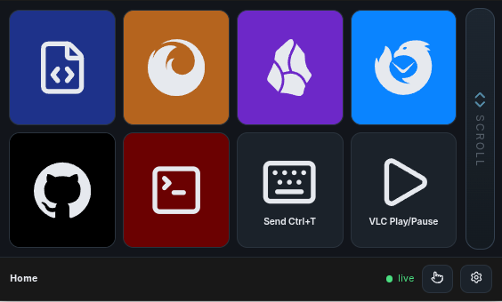
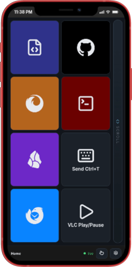
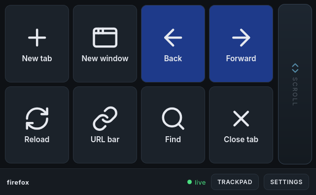
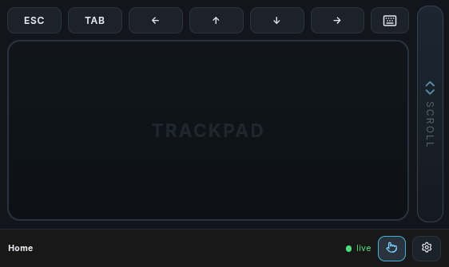

# deckd

App-aware touch control surface for your desktop. A Stream Deck-like deck of buttons, sliders, scroll strips, and a manual control mode (a single combined trackpad + keyboard passthrough), rendered in any browser on any touchscreen device, driven by a local daemon that watches the focused application and swaps layouts automatically.

## Uses

- Control your desktop from your phone, or tablet, or laptop
- Control multiple computers from one surface
- Control slides/presentations
- Get custom controls for each app you are using — including **websites**: play/pause and skip on YouTube or Netflix, or turn a site into an on-screen piano (see [Web-app layouts](#web-app-layouts); title-based, so best-effort today)
- Automatically switch display depending on which app is active
- Expose hotkeys for launching apps, or keyboard shortcuts
- Use phone as a mouse, scrollbar, and keyboard controller
- Voice typing from your phone to desktop


## Screenshots


### Home launcher



### Portrait phone view



### Firefox



### Trackpad/keyboard



## Status

Pre-alpha, but usable day-to-day. Here's what deckd can do today and what's still planned.

**Working today**

- [x] **Automatic per-app layouts** — focus a window on the desktop and the phone's browser flips to that app's buttons automatically.
- [x] **Web-app layouts** — treat a website as an app. A layout can claim a site by matching the browser's window title (e.g. YouTube and Netflix media controls), driving each site's own keyboard shortcuts. See [Web-app layouts](#web-app-layouts).
- [x] **Buttons** that fire keystrokes, shell commands, launch a terminal, or call D-Bus methods.
- [x] **Macros** — chain multiple actions in a single button press, with delays and optional continue-on-error.
- [x] **Button styling** — bundled icons (Lucide glyphs + Simple Icons brand logos) and per-button background colours, set in YAML.
- [x] **Scroll strip** — an always-on right-side jogstrip to scroll the focused window, with release momentum.
- [x] **Manual control mode** — the phone becomes a trackpad (move, tap, right-click, drag-lock) and a keyboard, so you can type into and point at the focused app for the things layouts don't cover (URL bars, chat boxes, ad-hoc commands).
- [x] **App badge** — the focused app's name, icon, and accent color show in the bottom bar so you can tell at a glance what you're controlling.
- [x] **Chrome media indicator** — the media icon sprouts a pulsing green dot whenever a media player is playing (passive playback indicator), independent of the browser view.
- [x] **Now playing** — control any supported media player (Spotify, Firefox, VLC, etc.) from a dedicated chrome view, with album art, per-player transport controls, and now-playing metadata.
- [x] **Running programs list** — tap a layout-grid icon in the bottom chrome to open a list of every open window on the host, labeled by the layout the window would match. Tap a row to raise (focus) that window and close the list. Enumeration and raise are GNOME-only today (via the focus extension); other backends show the list's "unsupported on this platform" empty state.
- [x] **VLC media widgets** — full VLC control surface with play/pause, seek, volume, album art. Configurable art sources (VLC embedded art + iTunes fallback).
- [x] **Live sensor widgets** — meter and stats widgets pushed to the client in real time (CPU %, memory %, etc.), bound to daemon-side sensor sources.
- [x] **GUI layout editor** — build and edit layouts from the browser without hand-editing YAML: a widget palette, a drag-to-reorder reflow canvas with span and overflow controls, a properties panel (labels, icons via a searchable picker, colours, actions and macros), and new-layout creation — saved back to disk over the write API. In development, but usable today. See [Layout editor](#layout-editor).
- [x] **Live layout editing** — edit a layout file on the desktop (by hand or via the GUI editor) and every connected phone/tablet re-renders instantly; a bad edit shows an error in place instead of crashing.
- [x] **Per-device tuning** — a settings panel for scroll speed/direction, trackpad sensitivity, content and text size, bar sizes, and keep-screen-awake, all saved on the device.
- [x] **Addressable client views** — the layout, manual control, now playing, settings, editor, and running-windows views have their own URL paths for deep links and browser history.
- [x] **Keep screen awake** while the surface is in use.
- [x] **Install to home screen** (PWA) for a fullscreen, app-like surface.
- [x] **Password auth** — every client authenticates with a shared password (on by default; `--no-auth` disables it for local development). See [Client auth](#client-auth).
- [x] **LAN scope control** — bind the daemon to a specific network interface (`--bind iface:wlan0`) or literal address; defaults to localhost-only for safety.
- [x] **Accessibility** — keyboard navigation, visible focus ring, screen-reader landmarks and live announcements, larger controls, high contrast, and reduced motion.
- [x] **Runs on Linux: GNOME (Wayland), KDE Plasma (Wayland), X11**
- [x] **Runs on MacOS (barely tested)**

**Planned**

- [ ] **Screensaver & suspend sync** — dim/lock the surface when the desktop sleeps.
- [ ] **One-step NixOS install** — a production module instead of the current spike.
- [ ] **Multiple simultaneous clients** with per-device layouts and resolutions.
- [ ] **Soundboard** — trigger sound clips from the deck.
- [ ] **Multi-daemon chooser** — pair and pick between several desktops.
- [ ] **Reliable web-app detection** — a browser extension reporting the active tab's real URL, so sites match by domain/path instead of the current window-title heuristic ([#90](https://github.com/jonocodes/deckd/issues/90)).
- [ ] **Windows support**
- [ ] **Packing and deployment**

## Inspiration and Comparison

The original inspiration was the Stream Deck, and I like all these projects. I wanted something that could do more, have open ended controls, and work across platforms.


| Feature | [deckd](https://github.com/jonocodes/deckd/issues) | [Stream Deck](https://www.elgato.com/us/en/s/explore-stream-deck)* | [KDE Connect](https://kdeconnect.kde.org/) | [Apple Touch Bar](https://support.apple.com/guide/mac-help/use-the-touch-bar-mchlbfd5b039/mac) | [Remote Touchpad](https://github.com/Unrud/remote-touchpad) |
|---|---|---|---|---|---|
| Controller agnostic | ✅ | ❌ | ✅ | ❌ | ✅ |
| Cross platform | ✅ | ✅ | ✅ | ❌ | ✅ |
| Connection | Browser (WiFi) | USB | WiFi | Built-in | WiFi |
| Custom layouts | ✅ | ✅ | ❌ | 🟡 | ❌ |
| Custom layouts for web apps* | ✅ | ❌ | ❌| ❌ |❌ |
| Open source | ✅ | 🟡† | ✅ | ❌ | ✅ |
| Browser-based client | ✅ | ❌ | ❌ | ❌ | ✅ |
| Keyboard command triggering | ✅ | ✅ | 🟡 | 🟡 | ❌ |
| Global media control | ✅ | ✅ | ✅ | ✅ | ❌ |
| Mouse/touchpad control | ✅ | ❌ | ✅ | ❌ | ✅ |

\*Make layouts for any website with keyboard controls. Examples: YouTube, Google Meet, Twitch

†[OpenDeck](https://github.com/nekename/OpenDeck#showcase), and [Boatswain](https://flathub.org/en/apps/com.feaneron.Boatswain) are open source; Elgato's SDK is not

## Architecture

```
                        ┌──────────┐
                        │  Phone / │
                        │  Tablet  │
                        │  Browser │
                        └────┬─────┘
                             │
                      WebSocket (ws://)
                             │
          ┌──────────────────┼───────────────────┐
          │             deckd daemon             │
          │            (aiohttp, asyncio)        │
          │                                      │
          │  ┌──────────┐  ┌──────────┐          │
          │  │  Layout  │  │  Action  │          │
          │  │  Loader  │  │ Dispatch │          │
          │  └──────────┘  └────┬─────┘          │
          │         │           │                │
          └─────────┼───────────┼────────────────┘
                    │           │
        layouts/*.yaml    ┌─────┴─────┬──────────┐
                          │           │          │
                      uinput       shell     D-Bus
                     (evdev)     (subprocess)  gdbus
                          │                    │
              scroll + keys + pointer  ┌───────┴───────┐
                          │            │               │
                     /dev/uinput   GNOME Shell     (xdotool —
                                   Extension        any X11 DE)
                                  deckd-focus
                                   @local

                            ┌──────────────────┐
                            │  Focus watchers  │
                            └──────────────────┘
                              GNOME Shell ext.   (Wayland, GNOME)
                              KWin script        (Wayland, KDE Plasma)
                              xdotool           (any X11 session)
                              osascript          (macOS)
```


## Layout

```
daemon/deckd/      Python daemon: aiohttp server, WebSocket, layout loader, action dispatch
client/            Vite + React + TS web client (the dumb renderer)
layouts/           Per-app YAML layouts (default.yaml + one per app)
scripts/smoke.py   End-to-end test that boots the daemon over WS, clicks every button
docs/INCEPTION.md  Full design doc — source of truth for *what* and *why*
```

### Web-app layouts

A layout normally claims a desktop app by putting its `app_id`/`wm_class` in the
`match:` list. A layout can also claim a **website** with a `title:` token — a
case-insensitive glob matched against the focused browser's *window title*:

```yaml
match:
  - "title:*- YouTube*"   # any tab whose title ends in "- YouTube"
```

When the focused app is a browser, a `title:` match outranks a generic
browser layout (so `youtube.yaml` wins over `firefox.yaml`), and falls back to
the browser layout when no site matches. The buttons are ordinary actions —
the shipped `layouts/youtube.yaml` and `layouts/netflix.yaml` drive each site's
own keyboard shortcuts (`key: k`, `key: s`, …), so no special capability is
needed beyond a layout file.

The same idea also turns a site into an **on-screen musical keyboard**:
`layouts/musicca.yaml` matches `title:*Musicca*` and fires the letter/number
keys that [Musicca](https://www.musicca.com/piano)'s keyboard instruments listen
for (top letter row = white keys, number row = black keys). Because Musicca's
piano and synthesizer share one mapping, a single layout plays both — and any
other site using the same mapping, once you add its title to `match:`. It's just
keystrokes (no MIDI/velocity). See [#96](https://github.com/jonocodes/deckd/issues/96)
for range/sustain/UI follow-ups.

**This is a heuristic.** Desktop focus backends can only see the browser's
window title, never the active tab's URL, so:

- a site is only matchable if its name appears in the `<title>`;
- sub-pages of the same site can't be told apart (both share a title suffix);
- the match breaks silently if a site changes how it formats its title.

Reliable URL/domain matching is planned via a browser extension
([#90](https://github.com/jonocodes/deckd/issues/90)).


## Running deckd

You need Python 3.11+ and Node 18+. Dependencies are managed with `[uv](https://docs.astral.sh/uv/)`:

```sh
# 1. Install uv (one-time)
curl -LsSf https://astral.sh/uv/install.sh | sh
export PATH="$HOME/.local/bin:$PATH"

# 2. Create the venv and install deps
uv venv --python 3.12
uv pip install -e ".[dev,uinput,dbus]"   # aarch64: source-builds python-evdev — see note below

# 3. Install JS client deps (once)
cd client && npm install && cd ..

# 4. Build the client so the daemon can serve it
just build-client

# 5. Run the daemon (serves the built client at http://127.0.0.1:8765)
just run-daemon
```

Open `http://127.0.0.1:8765` in any browser. You should see the active layout's buttons filling the main area, an always-on jogstrip pinned to the right edge, and a chrome bottom strip with the app name, a connection status dot, a `manual control` button, and a `settings` button. Drag or flick vertically on the right-side jogstrip to emit `REL_WHEEL_HI_RES` deltas through uinput (log-only when uinput is unavailable). Tap the `manual control` button to swap the button grid for a combined trackpad + IME surface — see the [Manual control mode](#manual-control-mode) section.

> **aarch64 Linux (e.g. Asahi):** `evdev-binary` publishes x86_64 wheels only, so it can't cover aarch64. Instead `just setup-linux` source-builds `python-evdev` via `scripts/install_evdev_source.sh` (the `uinput` extra also declares plain `evdev` on non-x86_64 via a `platform_machine` marker). The source build needs a C compiler and kernel headers — the flox dev env pins `gcc` for exactly this (Nix hides the headers from evdev's `build_ecodes`, so the script locates them via the compiler and passes them explicitly). With that plus `/dev/uinput` write access (see [uinput permissions](#uinput-permissions)), scroll/key/trackpad injection works natively on aarch64, **including KDE Plasma Wayland** — keys are injected at the kernel evdev layer, so the compositor routes them to the focused window. If the build is skipped the sink degrades gracefully to log-only.


### macOS

The daemon runs on macOS via `daemon/deckd/platform_macos.py` — focus + key injection work out of the box, and the jogstrip + trackpad need `pyobjc-framework-Quartz` (pulled in via the `[macos]` extra). The GNOME Shell focus extension is Linux-only. The `[dbus]` extra (`dbus-fast`) is Linux-only and deliberately skipped on macOS — there's no session bus and the default layout's D-Bus/MPRIS targets don't exist, so the daemon wires a null bus factory and serves without the `dbus:` action primitive or MPRIS now-playing (issue #27).

Setup (no `uv`/uinput bits):

```sh
just setup            # auto-picks setup-macos on Mac, setup-linux elsewhere
just build-client
just dev-daemon       # listens on http://127.0.0.1:8765, auto-restarts on Python edits
```

`just dev-daemon` wraps the daemon in the `deckd-dev` supervisor so Python edits hot-reload (YAML hot-reloads either way). For a one-shot `deckd` invocation use `just run-daemon`.

To force a specific platform's setup (e.g. on a CI box): `just setup-linux` or `just setup-macos`.

First time you focus a non-default window, **System Events** will pop a TCC prompt asking you to allow the controlling terminal/iTerm/whatever wraps Python. Accept it once and the focus watcher runs forever after. The focus backend uses the process name as `app_id`, so layouts match by process name — `firefox`, `Terminal`, `kitty`, `code` etc. work as-is. The GNOME-specific per-app YAMLs (`org.gnome.Console`, `foot`, `konsole`…) won't match on macOS unless you rename them to the Mac process name.

What works / doesn't on macOS:


| capability                         | macOS                                                                                   |
| ---------------------------------- | --------------------------------------------------------------------------------------- |
| focus detection                    | yes (osascript + System Events)                                                         |
| running-window enumeration         | yes (Quartz `CGWindowList`, front-to-back order) — app names only, see TCC below         |
| running-window raise              | yes (AppKit activation + Accessibility `AXRaise`)                                       |
| running-window row → layout match  | yes (identity matching is case-insensitive, so `CGWindowList`'s `Firefox` matches the `firefox` token — #140) |
| `key:` action (printable + combos) | yes (osascript `keystroke`)                                                             |
| `key:` action (non-printable)      | partial (HID-code map covers the common ones — arrows, esc, tab, enter, F-keys)         |
| `shell:` / `terminal:` actions     | yes                                                                                     |
| `dbus:` action                     | no (macOS D-Bus exists but GNOME services don't)                                        |
| MPRIS media browser + chrome media icon | no (MPRIS is session-bus D-Bus; `/mpris/players` reports `available: false`) — [#56](https://github.com/jonocodes/deckd/issues/56) tracks a MediaRemote equivalent |
| `media` widget (VLC HTTP backend)  | untested (plain HTTP to VLC's web interface — nothing platform-specific in the path)     |
| trackpad pointer + clicks + drag   | yes (PyObjC Quartz `CGEventCreateMouseEvent`)                                           |
| jogstrip scroll                    | yes (PyObjC Quartz `CGEventCreateScrollWheelEvent` — pulled in via the `[macos]` extra) |

Machine-verified on hardware 2026-08-06 (macOS 15.6.1, Apple Silicon) by driving the running daemon over its own WebSocket API: focus, enumeration, raise, and pointer deltas. Scroll, clicks, and key injection are implemented but **nobody has watched an injected event land in an app** — see the evidence table in [PLATFORM-PARITY.md](docs/PLATFORM-PARITY.md#verification-status) for what's actually been observed versus what merely compiles.

**TCC permissions are per-process-tree, and that bites.** macOS attributes a grant to the *responsible* process — the terminal (or launchd agent) that started the daemon — not to `python` itself. Consequences worth knowing before you debug the wrong layer:

- **Accessibility** gates Quartz `CGEventPost` *and* the `AXRaise` half of raise. Without it, pointer/click/drag/scroll are **silently dropped** (no error, no log line) and `raise_window` fails with `kAXErrorAPIDisabled` (-25211) after the app has already been activated — so the app comes forward but the specific window doesn't rise.
- **System Events** (the focus + `keystroke` path) is a *separate* grant, which is why focus detection and key injection can work fine while every Quartz path is dead.
- Run the daemon from a *different* terminal (or under an editor/agent harness) and you inherit that tree's grants, not the ones you clicked through earlier.
- **Screen Recording** gates `kCGWindowName`. Without it every enumerated window's `title` is `None`, so the running-windows list is labelled by app name alone. deckd works either way — the label falls back — but title-based layout matching (`title:` tokens) can't see enumerated windows.

When the layout doesn't switch as expected, run `python scripts/check_focus_macos.py` for a one-shot diagnostic: it prints what `osascript` reports for the frontmost app, whether the auto-ignore rule would hold, and which layout `resolve_layout` would pick. Saves reading the daemon log for the common cases (TCC denied, stale daemon, wrong app_id).

### KDE Plasma Wayland

Two KDE-specific pieces on top of the base setup: a **KWin script** for focus-based layout switching, and `/dev/uinput` **access** so button/scroll/trackpad injection actually reaches apps. This walkthrough is distro-neutral; Nix/flox users get the extra CLI tools automatically (see the [Tooling note](#kde-plasma-wayland-sessions) under the focus watcher) and can skip the package-install hints.

**0. Check the KDE CLI tools are present.** These ship with a standard Plasma 6 desktop; run this to spot any gaps:

```sh
for t in kpackagetool6 kwriteconfig6 qdbus gdbus; do command -v "$t" >/dev/null || echo "missing: $t"; done
```

If something is missing, install it from your distro: `kpackagetool6`/`kwriteconfig6` come with **KDE Frameworks 6** (KPackage / KConfig tools), `qdbus` with **Qt 6 tools**, and `gdbus` with **glib** (Debian/Ubuntu `libglib2.0-bin`, Fedora `glib2`, Arch `glib2`). The daemon shells out to `gdbus` on every focus poll, so it's not optional.

**1. Install deps and build the client.**

```sh
just setup          # venv + Python/JS deps incl. the uinput sink (auto-picks setup-linux)
just build-client
```

On **x86_64** the `uinput` extra installs the prebuilt `evdev-binary` wheel. On **aarch64** (e.g. Asahi) there is no such wheel, so `just setup-linux` source-builds `python-evdev` instead — that needs a C compiler and kernel headers:

```sh
# Debian/Ubuntu
sudo apt install build-essential linux-libc-dev
# Fedora
sudo dnf install gcc kernel-headers
# Arch
sudo pacman -S base-devel linux-api-headers
```

**2. Grant** `/dev/uinput` **write access.** Without it, keys/scroll/trackpad are silently no-ops (the daemon logs `platform sink unavailable` at startup). Follow [uinput permissions](#uinput-permissions) — the udev rule plus adding yourself to the `input` group, then log out and back in. `just check-uinput` confirms it.

**3. Run the daemon**, then install the focus KWin script:

```sh
just run-daemon                 # owns org.deckd.Focus; serves the client at :8765
just install-focus-kwin         # installs + enables + hot-starts the KWin focus script
```

Order matters slightly: the script pushes focus to the *running* daemon, so start the daemon first (or just re-run `install-focus-kwin` afterwards — see [Cold-start ordering](#kde-plasma-wayland-sessions)). Details and verification are in [KDE Plasma Wayland sessions](#kde-plasma-wayland-sessions) under the focus watcher.

**4. Verify.** Open `http://127.0.0.1:8765`, focus different apps and watch the layout follow (`just watch-focus`), and press a browser button — it should fire the keystroke in the focused window. If buttons do nothing, it's almost always step 2 (`just check-uinput`).

### Phone/tablet testing

The phone must load the web client from a daemon address it can reach. Build the client, run the daemon on all interfaces, then open the desktop's LAN IP from the phone:

```sh
just build-client
just run-daemon-lan

# In another terminal, find the desktop IP:
hostname -I
```

Open `http://<desktop-lan-ip>:8765` on the phone, for example `http://192.168.30.117:8765`. The client connects its WebSocket back to the same host automatically, so no separate `VITE_DECKD_WS` setting is needed for this built-client path.

### Design tooling (no daemon required)

The client can be viewed and design-iterated without a running daemon:

- **Demo mode** — append `?demo=<name>` to the client URL (`firefox`, `default`, or `showcase`) to render a fixture layout with the WebSocket disabled. The `showcase` fixture exercises every icon path (Lucide glyphs, Simple Icons brand logos, per-button colour, a no-icon button, and the unknown-icon placeholder). Dev-only; adds no cost when the param is absent. (For forcing a *real* daemon layout with a live backend, use the per-client `?layout=<name>` pin — see [Layout override](#dev-ux-auto-ignore--layout-override).)
- **Responsive gallery** — `cd client && npm run dev`, then open `/gallery.html`. Renders the real client in phone / large-phone / 7" / 10"-tablet iframes at once, with layout, orientation, and **key hints** selectors — for checking how a layout reads across screen sizes (the key-hints toggle drives each frame's `?showKeyHints=1`). Dev-only entry, not in the production build.
- **Screenshot page** — `cd client && npm run dev`, then open `/screenshots.html`. Renders curated demo views inside phone-framed iframes, one per configured shot — the source of truth for `just screenshots`. Curate the list by editing the `SHOTS` array in `client/src/Screenshots.tsx`.
- **Ladle** (component workbench) — `cd client && npm run ladle`. Browse `ButtonGrid` / `Icon` / `JogStrip` stories in isolation with width/theme controls, plus `Surface → Device sizes` stories that render the grid in fixed phone/tablet frames (size + orientation) for a quick per-component resolution check. Stories live in `src/*.stories.tsx` (Storybook-compatible CSF).
- **Lint** — `cd client && npm run lint` (ESLint flat config; `npm run build` still runs `tsc --noEmit`).


### Hosted demo (GitHub Pages)

Every push to `main` builds the client and Ladle and publishes them to GitHub Pages, so the previews above can be browsed with no daemon and no local checkout:

- **Live client (demo mode)** — `https://jonocodes.github.io/deckd/?demo=showcase` (also `?demo=firefox`, `?demo=default`). Without `?demo=` the client loads and shows "disconnected" since there's no daemon behind the Pages site; the param lets the fixture layout run.
- **Responsive gallery** — `https://jonocodes.github.io/deckd/gallery.html`.
- **Ladle stories** — `https://jonocodes.github.io/deckd/ladle/`.

Source: `.github/workflows/deploy-pages.yml`. The Vite build uses `VITE_BASE_PATH=/deckd/` and the Ladle build uses `--base /deckd/ladle/` so the Project-Pages sub-path resolves; local dev keeps base `/`. Reproduce the deploy bundle locally with `just build-pages` (output: `client/dist/`) and serve it with `npx serve client/dist`.

### PWA install over HTTPS (Tailscale)

"Add to Home Screen" on Android Chrome / Edge only prompts over a **secure context** (`localhost` or HTTPS). Plain `http://<lan-ip>:8765` from a phone doesn't qualify, so the install banner never shows. iOS Safari is looser and accepts HTTP LAN, so it's Chrome/Edge that need help.

If both devices are on a [Tailscale](https://tailscale.com/) tailnet, deckd has a `just dev-client-tailscale` recipe that:

1. Uses `tailscale cert` to provision (or reuse) a Let's-Encrypt cert for your tailnet hostname.
2. Runs Vite's dev server on `:5173` with HTTPS backed by that cert.
3. Configures Vite to proxy `/ws` and `/health` to the local daemon on `:8765`, so the whole app is same-origin — no extra `VITE_DECKD_WS` config, HMR still works, PWA install still eligible.

```sh
# One-time: enable HTTPS certs for your tailnet
# https://login.tailscale.com/admin/dns  →  "Enable HTTPS"

# Terminal 1 — daemon on localhost (the recipe expects it at 127.0.0.1:8765):
just dev-daemon

# Terminal 2 — Vite HTTPS backed by tailscale cert:
just dev-client-tailscale
```

On first run the recipe writes `<host>.crt` / `<host>.key` under `client/.tls/` (gitignored). Then it prints the URL. Open `https://<hostname>.<tailnet>.ts.net:5173/` on the phone — Chrome's install banner should appear, tap "Add to Home Screen", and deckd installs fullscreen.

Cert files last ~3 months (Let's Encrypt); delete `client/.tls/*` and rerun the recipe to renew.

**What Tailscale is (and isn't) doing.** This flow uses Tailscale for three lightweight things, and nothing else:

1. **DNS.** `<host>.<tailnet>.ts.net` resolves to the desktop's tailnet IP.
2. **Routing.** The phone (on the tailnet) can reach that IP.
3. **The cert.** `tailscale cert` mints a Let's Encrypt cert for the hostname and drops the `.crt` / `.key` files where Vite reads them.

Tailscale is **not** running an application proxy — `tailscale serve status` will show nothing when this is set up, and that's correct. Vite binds `0.0.0.0:5173` directly with HTTPS, terminates TLS with the cert itself, and proxies `/ws` internally to the daemon at `127.0.0.1:8765`. The phone's connection lands on Vite; the daemon only ever sees localhost traffic.

That's why the URL you see in devtools is `wss://<host>.<tailnet>.ts.net:5173/ws` (Vite's port), not `:8765` (daemon's port).

**Troubleshooting — page loads but `wss://…:5173/ws` won't connect and no password prompt appears.** This is almost always the daemon being down, not a cert problem: the page loads over HTTPS (so the cert is fine, and `wss://` reuses it), but Vite's `/ws` proxy has no upstream to forward to, so the socket is dropped mid-handshake. Because the auth exchange never completes, the client never receives the `unauthorized` frame and the password gate never renders — it just loops on reconnect. Check `curl -s http://127.0.0.1:8765/health`; if it fails, (re)start the daemon. Note the password lives in per-origin `localStorage`, so entering it once at `localhost:5173` does **not** carry over to the `<host>.ts.net:5173` origin — enter it again there. If the daemon itself won't start, it now fails fast with `cannot bind 127.0.0.1:8765 — another process is already listening there` (usually a stale `deckd`); clear it with `pkill -f bin/deckd` and relaunch.

**Contrast:** `tailscale serve` **(persistent URL, no dev server).** If you want an installable PWA at `https://<host>.<tailnet>.ts.net/` (no port, works without any process running on the desktop besides the daemon), that's a different setup — `just build-client` + `just run-daemon` + `tailscale serve --bg 8765`. Tailscale proxies `:443 → 127.0.0.1:8765`, the daemon serves the built `client/dist/`. You lose HMR but gain a URL that survives closing your dev terminals. Not covered by any `just` recipe yet — file an issue if you want one.

### Client chrome

Every layout renders inside a persistent **chrome** shell that the daemon does not know about:

- **Bottom strip** (always visible): the current app badge (from `LayoutMessage.app` — optionally a branded icon + `display_name` + `theme` colour from the layout's YAML, see [Chrome app badge](#chrome-app-badge)), a connection dot (live / reconnecting / disconnected), a `manual control` button that swaps the main area for the combined trackpad + IME surface (see [Manual control mode](#manual-control-mode)), a `now playing` button (when enabled — see [Now playing](#now-playing); ADR-0008 records the chrome-view carve-out that lets the client pin a specific layout) that asks the daemon for the global now-playing view, and a `settings` button (see [Client tuning](#client-tuning)).
- **Right-side jogstrip** (always visible): a full-height scroll strip that works the same as the in-grid `jogstrip` widget. A layout can suppress it with `jogstrip: false` at the YAML top level — the daemon forwards this as `jogstrip_enabled` on every `LayoutMessage`.

Widgets in a layout's `widgets:` list are an **ordered list** that reflows against the viewport width (ADR-0010). There are no grid coordinates. The client packs widgets left-to-right and wraps down, computing the column count from the available width against a client-side cell-size band. A widget may carry a `size: [w, h]` span (default `[1, 1]`) for non-uniform cells; the list order is the only positional input. Portrait just fits fewer columns — no transpose, no orientation conventions.

### Manual control mode

Tap the `manual control` button in the bottom chrome and the layout area is replaced by a single combined surface: a **trackpad** for cursor movement and a **keyboard passthrough** for typing into the currently-focused desktop app, both live at the same time. No mode switching. The trackpad handles pointing and clicking, and a small **strip at the top** of the surface hosts the few keys mobile IMEs can't produce (Esc, Tab, arrows) plus a keyboard-icon toggle that raises the phone's soft keyboard when you want to type. When the IME is open you can still drag on the trackpad area to move the cursor — the two coexist.

Manual control covers the long tail layouts don't: URL bars, chat boxes, ad-hoc commands, plus anywhere you'd normally reach for a trackpad. Known per-app shortcuts stay in layouts as buttons.

**Trackpad gestures** (client-side; daemon receives `pad` / `pad_tap` / `pad_drag` events and maps them to `REL_X` / `REL_Y` + `BTN_LEFT` / `BTN_RIGHT` on the same uinput device that handles keys and scroll):


| Gesture                                                      | Action                                                            |
| ------------------------------------------------------------ | ----------------------------------------------------------------- |
| One-finger drag                                              | Move the desktop cursor (relative motion, like a laptop trackpad) |
| Quick tap (< 250ms, < 10px)                                  | Left click                                                        |
| Two-finger tap (both down, both up together)                 | Right click                                                       |
| Tap-and-a-half (tap, then touch again within 400ms and drag) | Left button held during the drag; release on finger lift          |


The right-side jogstrip stays available for scrolling while you're pointing.

**Keyboard passthrough** is opt-in: the IME is closed when you enter manual control. Tap the keyboard-icon button on the strip to raise the phone's soft keyboard; tap it again to dismiss. While the IME is open, the hidden input behind the trackpad captures glyphs and forwards them to the daemon via the `type` / `key` wire messages — the same path layout `key` actions use. The trackpad surface still captures pointer events; you can type and move the cursor in the same session without switching modes.

- **The IME does the typing.** Letters, symbols, autocorrect, swipe-typing — the client diffs the hidden field's contents on every input event and sends the delta (`type` message), so whatever the IME commits is what the desktop gets. Enter and Backspace travel as named `key` messages instead (Android: via `beforeinput` inputType inspection; iOS / physical keyboards: via `keydown`).
- **Minimal strip.** Mobile keyboards have no Esc / Tab / arrow keys, so the strip at the top of the surface sends those as named combos. There are deliberately no sticky Ctrl/Alt modifiers — combos belong in layouts.
- **ASCII only, US layout.** Injected text is translated to evdev keycodes char-by-char; capitals and shifted symbols get an implicit Shift per the **US keyboard layout**. The desktop's own layout reinterprets keycodes, so exact fidelity requires the desktop to use US layout. Anything outside printable ASCII (accented characters, CJK, emoji) is logged and dropped.
- **Focus guard.** Injected keystrokes land on whatever window has desktop focus. If that's the deckd client itself (you opened the client on the same machine as the daemon), the daemon drops `type` / `key` messages rather than feed the client's own input back into itself.
- **Physical keyboards.** A Bluetooth keyboard paired to the phone works through the `keydown` path with no extra setup.

> ⚠️ **Security.** The keyboard passthrough is a remote text-injection primitive — with a terminal focused it is arbitrary command execution. Every client authenticates with a shared password (see [Client auth](#client-auth)) unless the daemon is started with `--no-auth`. The password is a single shared secret over a plaintext WebSocket, not per-user auth or transport encryption — still expose the daemon (`--bind 0.0.0.0`) only on a network you trust, ideally a Tailscale tailnet, and put TLS in front of it if the link isn't already private. (Auth is enforced from the `hello` message, so it holds up behind a proxy — a TLS terminator or the Vite dev proxy — without any `X-Forwarded-For` trust.)


### Layout editor

Tap the **layout editor** button in the bottom chrome (next to now playing / settings) to build and edit layouts in the browser — no hand-editing YAML. Like manual control and now playing, it's a chrome view that swaps in over the button grid.

- **Palette** — pick a widget kind (button, jogstrip, meter, stats, media, blank, …) to append it to the layout.
- **Reflow canvas** — widgets render exactly as the live deck does (ADR-0010, ordered-list reflow). Drag to reorder, adjust a widget's `size` span, and toggle the layout's `overflow` mode; the canvas repacks as you go.
- **Properties panel** — edit the selected widget's `label`, `icon` (via a searchable Lucide / Simple Icons picker), `color`, and its `action` or `macro`. Fields the editor doesn't model yet are passed through opaquely, so editing a layout never drops hand-authored config.
- **New layouts** — create a layout from scratch, setting its `match:` list; the filename is derived from the primary match token on first save.

Saving writes back to disk over the authed write API (`PUT`/`POST /layouts`, below), preserving YAML comments and widget identity; `watchfiles` then hot-reloads every connected client. The editor is in active development — most YAML is round-trippable today, but hand-editing remains the escape hatch for anything it doesn't yet surface.

### Chrome app badge

The bottom strip's app badge carries the focused app's brand identity, sourced from the active layout's YAML — three optional top-level fields the daemon relays opaquely to the client:

- `display_name: Mozilla Firefox` — the human-readable label shown instead of the raw `match` token. Without it the badge falls back to the match token.
- `theme: "#ff7139"` — any CSS colour string (hex, `hsl(...)`, named); tints the badge border and a thin accent stripe along the top edge of the bottom chrome, so the focused app reads at a glance from across the room.
- `icon: { source: simple-icons, name: firefox }` — the same `{source, name}` dispatch widgets already use (ADR-0006); reuses the bundled Lucide + Simple Icons sets, so badging a new app is a YAML edit with no client/daemon rebuild.

A layout with none of these keeps the chrome unchanged (the badge is just the bold app name). The daemon never resolves icons from `.desktop` files or the web — presentation stays in user-owned config, exactly like per-widget `color`. See ADR-0007 for the full rationale.

```yaml
match:
  - firefox
display_name: Firefox
theme: "#ff7139"
icon:
  source: simple-icons
  name: firefox
widgets:
  - ...
```


### Client tuning

Tap the `settings` button in the bottom chrome for a control panel:

- **Scroll scale** (slider, integer 1–10, default 3) — high-resolution wheel units per CSS pixel.
- **Scroll invert** (toggle) — flip vertical scroll direction.
- **Bar width** (slider, 40%–100%, default 100%) — width of the persistent right-side jogstrip (the scroll bar), as a fraction of its responsive base width, so you can slim it down on devices where it reads as too wide.
- **Trackpad sensitivity** (slider, float 0.5×–3.0×, default 1.0×) — multiplier applied to raw pointer deltas before they're sent to the daemon.
- **Content size** (slider, float 0.75×–2.5×, default 1.0×) — multiplier for grid content (button icon + label, in-grid jogstrip) on top of the responsive base, so the deck stays readable across phone and tablet screens. The persistent chrome is unaffected.
- **Text size** (slider, float 0.5×–1.5×, default 1.0×) — multiplier for the button label (the caption under each icon), applied on top of Content size, so the text can be dialled down without shrinking the icon.
- **Bottom bar** (slider, 40%–100%, default 100%) — size of the persistent bottom chrome bar (app badge, connection indicator, trackpad + settings buttons), so you can shrink it down on devices where it reads as too tall.
- **Keep screen awake** (toggle, default on) — holds a Screen Wake Lock while the socket is open and the tab is visible, so a phone acting as the surface doesn't sleep mid-use. Released on tab hidden / socket disconnect; re-acquired on visible / reconnect. Unsupported browsers or denied permissions are logged and swallowed.
- **Show key hints** (toggle, default off) — renders the key combo a button sends (its `action.key`, or the first `key` step of a macro) as a small dimmed caption under the label, e.g. `Ctrl+A`. Buttons whose action isn't a key combo (shell, url, dbus, …) show no hint.

Values persist per-device to `localStorage` — closing and reopening the client keeps your tuning. The persistent right-side jogstrip stays live inside the settings view so you can feel scale/invert changes immediately.

URL query params still work as a one-shot dev override (won't touch `localStorage`):

```text
http://<host>:5173/?scrollScale=2
http://<host>:5173/?scrollScale=4&scrollInvert=1
http://<host>:5173/?padSensitivity=1.5
http://<host>:5173/?contentScale=1.5
http://<host>:5173/?labelScale=0.7
http://<host>:5173/?jogWidth=0.6
http://<host>:5173/?bottomScale=0.7
http://<host>:5173/?wakeLock=0
http://<host>:5173/?showKeyHints=1
```

Daemon-side flick momentum can be tuned with CLI flags:

```sh
.venv/bin/deckd --layouts-dir layouts \
  --scroll-momentum-friction 0.90 \
  --scroll-momentum-cutoff 20 \
  --verbose
```

Lower friction decays faster; `--scroll-momentum-friction 0` effectively disables momentum after one frame. The helper script can test release momentum without the touch UI:

```sh
sleep 2 && .venv/bin/python -u scripts/send_scroll.py --velocity 1200
```


### Accessibility

The client is usable end-to-end without a mouse (issues [#60](https://github.com/jonocodes/deckd/issues/60) and [#62](https://github.com/jonocodes/deckd/issues/62)).

**Keyboard navigation** — `Tab` walks every interactive element in DOM/logical order: the bottom-chrome buttons (manual control / now playing / settings), the layout's widgets, the in-grid jogstrip, the settings sliders and toggles. `Shift+Tab` walks back. The focused element has a high-contrast cyan focus ring (a double-box-shadow; meets WCAG 2.1 SC 1.4.11 contrast); the ring is `focus-visible`-only, so a mouse click doesn't surface it.

**Keyboard activation** — every button (chrome, grid, media, nowplaying, settings, jog-strip) responds to `Enter` and `Space`. Native `<button>` elements get this for free when they have an `onClick`; the project's `onPointerDown`-only pattern (kept for fast touch response) is paired with a matching `onKeyDown` so the keyboard path is preserved.

**Keyboard alternatives for the pointer surfaces** — the right-side jogstrip and the trackpad each expose a keyboard mode so they aren't pointer-only:

| Surface     | Keys                                                                                            |
| ----------- | ----------------------------------------------------------------------------------------------- |
| JogStrip    | `↑/↓/←/→` (small step), `PageUp/PageDown` (large step), `Home`/`End` (jump), held = auto-repeat |
| Trackpad    | `↑/↓/←/→` (move), `Numpad 1/3/7/9` (diagonals), `PageUp/PageDown` (big step), `Space`/`Enter` (left click) |

**Global shortcuts** — `1` toggles trackpad mode, `2` opens now playing, `3` opens settings, `Escape` returns to the focused-app layout. Shortcuts are suppressed while a text input is focused, so typing into the password gate or the trackpad IME isn't hijacked.

**Focus restoration** — opening a chrome view (settings, trackpad, now playing) pushes focus into the first interactive element of that view; closing it (via `Escape` or the same button) hands focus back to the chrome button that opened it. The password gate also restores focus to the surface after a successful submit, so a keyboard user can Tab into the layout without clicking anywhere.

**OS-level preferences** — the theme respects `prefers-contrast: more` (thicker focus ring, higher-contrast cell borders, white halo on the connection dot) and `prefers-reduced-motion: reduce` (the connection-state pulse and the media-icon playback dot stop animating; press feedback loses its scale-down but keeps the static brightness shift). Status (connection state, playback state) is conveyed by **icon + text + colour** so it doesn't depend on colour alone: the connection indicator has a visible "live" / "reconnecting" / "disconnected" / "locked" label, and the media icon carries a screen-reader-only "now playing" / "idle" string alongside the pulsing green dot.

**Typography** — labels scale with the browser zoom *and* the existing Text-size slider; cell sizes use `clamp(min, vw, max)` so they grow with the viewport. The Content-size and Bottom-bar sliders affect icon + chrome sizes without clipping adjacent content.


### uinput permissions

Any real injection — scroll, **keys (browser buttons etc.)**, or trackpad — needs write access to `/dev/uinput`; without it the daemon logs `platform sink unavailable` at startup and every press is a no-op logged as `[key log]`. For a quick one-session test you can grant it with an ACL (reverts on reboot):

```sh
sudo setfacl -m u:"$USER":rw /dev/uinput
```

The reproducible setup is the udev rule plus membership in `input`:

```sh
sudo install -m 0644 packaging/udev/70-deckd-uinput.rules /etc/udev/rules.d/
sudo udevadm control --reload-rules
sudo udevadm trigger --subsystem-match=misc --sysname-match=uinput
sudo usermod -aG input "$USER"
```

On **NixOS**, don't do the above by hand — `packaging/nixos/deckd-spike.nix` already loads the `uinput` module, installs the same udev rule, creates the `input` group, and adds the daemon user to it (see the NixOS block below). Enable it (or lift those lines into your config) and relog.

Log out and back in, then check:

```sh
ls -l /dev/uinput
id
just check-uinput
```

On NixOS, import `packaging/nixos/deckd-spike.nix` and enable the spike service:

```nix
{
  imports = [ /home/jono/src/deckd/packaging/nixos/deckd-spike.nix ];

  services.deckd-spike = {
    enable = true;
    user = "jono";
    projectDir = "/home/jono/src/deckd";
    lan = true;
  };
}
```

Run `just setup` and `just build-client` in the checkout before starting the user service.

### Live reload

Layout YAML is watched by the daemon itself — any edit under `layouts/` is picked up automatically and pushed to every connected client. No manual `deckctl reload` needed. A broken save (bad YAML, schema violation) is trapped: the daemon keeps the last-good layouts live and sends a `LayoutMessage` with `error: "<parse error>"` so the client shows a diagnostic in place of the grid until the next successful save.

Python changes need a daemon restart. `just dev-daemon` runs a supervisor that watches `daemon/**/*.py` and restarts the child on save:

```sh
# Terminal 1
just dev-daemon           # daemon under a Python-file-restart supervisor

# Terminal 2 (LAN so a phone can hit it)
just dev-client-lan
```

Open `http://lute:5173` on the phone when hostname resolution is available, or use the Network URL printed by Vite. `lute` is listed in Vite's `server.allowedHosts`. `dev-client-lan` sets `VITE_DECKD_WS=ws://lute:8765/ws` automatically, so the Vite page still talks to the daemon.

### Focus watcher

GNOME Shell's built-in `org.gnome.Shell.Introspect` API returns `AccessDenied` for window queries. Instead, a tiny GNOME Shell extension (`deckd-focus@local`) publishes the focused window as JSON over session D-Bus (`org.deckd.Focus`). The daemon polls this at 100ms via `GnomeShellFocusBackend`.

Install and enable (relogin required on Wayland if the extension is not yet listed):

```sh
just install-focus-extension
# If it says "Installed but not enabled", log out/in then:
gnome-extensions enable deckd-focus@local
```

Verify:

```sh
just watch-focus           # polls and prints focus changes
just watch-focus-once      # single snapshot
```

Expected output:

```text
app_id='org.gnome.Console' wm_class='org.gnome.Console' pid=1234 title='Terminal'
app_id=None wm_class='firefox' pid=188566 title='YouTube — Mozilla Firefox'
```


#### X11 sessions (any desktop environment)

On any X11 session — XFCE, MATE, Cinnamon, Budgie, LXQt, KDE-X11, GNOME-X11, standalone i3/openbox, etc. — the focus watcher uses `[xdotool](https://manpages.ubuntu.com/manpages/xdotool)` directly. No GNOME extension is needed; no D-Bus service is required. The daemon picks `X11FocusBackend` automatically when `XDG_SESSION_TYPE=x11`.

Make sure `xdotool` is on `$PATH`:

```sh
# Debian / Ubuntu
sudo apt install xdotool
# Fedora
sudo dnf install xdotool
# Arch
sudo pacman -S xdotool
```

Then verify the same way:

```sh
just watch-focus           # app_id=None, wm_class=<class>, title=<title>
just watch-focus-once
```

On X11 there is no `app_id` analogue (no Wayland / Flatpak app id), so `app_id` is always `None` and layouts match on `wm_class` only. If `xdotool` is missing or cannot reach the display, `watch-focus` and the daemon both print an install hint instead of crashing.

#### KDE Plasma Wayland sessions

KDE Plasma Wayland does not export the active window to outside clients over a documented D-Bus interface (the spike in `docs/spike-kde-wayland-focus.md` ruled out every Wayland-protocol and `org.kde.KWin` session-bus path). Instead deckd ships a tiny **KWin script** that runs inside the compositor and `callDBus`-pushes the focused window snapshot into the daemon's own `org.deckd.Focus` cache over the session bus. The wire shape on the consumer side is byte-identical to the GNOME extension, so the daemon's `KdeFocusBackend` reads from the same in-process cache the GNOME backend polls via `gdbus`.

Install + enable + hot-start in one go:

```sh
just install-focus-kwin
```

**Tooling.** The recipe needs `kpackagetool6`, `kwriteconfig6`, and `qdbus` on `$PATH`, and the daemon itself shells out to `gdbus` (from glib) on every focus poll. On a stock Plasma 6 install these all come with the desktop. The flox dev env additionally pins `glib` (→ `gdbus`) and `kdePackages.kconfig` (→ `kwriteconfig6` / `kreadconfig6`) so `flox activate` covers the two tools NixOS doesn't put in the system profile — see the comments in `.flox/env/manifest.toml`. (`kconfig` is pinned to 6.26.0 there because 6.27+ moves those binaries into a `devtools` output flox's catalog resolver can't select.)

That recipe:

1. Installs the KWin Script package into `~/.local/share/kwin/scripts/deckd-focus/` via `kpackagetool6 -i` (falling back to `-u` when a copy is already installed).
2. Persists `deckd-focusEnabled=true` in `kwinrc` so the script survives relogin.
3. `qdbus org.kde.KWin /KWin reconfigure` applies the enable flag without a relogin.
4. Hot-starts the script via `org.kde.kwin.Scripting.loadScript`, which fires the script's initial `push(workspace.activeWindow)` against the running daemon's `org.deckd.Focus` cache so the layout switches to the currently focused app immediately instead of waiting for the next alt-tab.

Verify:

```sh
just watch-focus           # polls and prints focus changes
just watch-focus-once      # single snapshot
```

Expected output:

```text
app_id='org.kde.dolphin' wm_class='dolphin' pid=4242 title='Dolphin — Home'
app_id=None wm_class='firefox' pid=188566 title='YouTube — Mozilla Firefox'
```

If the KWin script isn't installed or the daemon couldn't own `org.deckd.Focus`, `watch-focus` and the daemon both print the `install-focus-kwin` hint and keep running on the default layout (the same graceful-failure stance the X11 backend takes when `xdotool` is missing).

**Lifecycle note.** The daemon owns `org.deckd.Focus` only on KDE Plasma Wayland sessions (`XDG_CURRENT_DESKTOP=KDE` + `XDG_SESSION_TYPE=wayland`), so the GNOME extension and the KDE daemon-side cache never fight over the same bus name. KDE-X11 falls back to the `xdotool` path documented above.

**Cold-start ordering.** Because KWin scripts can only `callDBus` outbound (they can't own a D-Bus name — see spike), the script's initial `push(workspace.activeWindow)` lands *nowhere* if the daemon isn't yet running. The cache stays empty until the next window activation, or until you re-run `just install-focus-kwin` (which hot-reloads the script and re-fires the initial push against the now-running daemon). Long-running sessions with the script enabled in `kwinrc` automatically re-fire the initial push on the next KWin restart, so day-to-day use doesn't require re-running the recipe.

### Dev UX: auto-ignore + layout override

Two conveniences for local development without a separate device:

**Auto-ignore.** When the focus watcher reports the deckd client browser window gaining focus (matched by the daemon's own port appearing in the window title, or the deckd page title `"deckd"` in the title), the daemon **holds the current layout** instead of switching away. So clicking the browser tab that's rendering the control surface doesn't flip the layout to the browser's own (e.g. Firefox) layout while you're testing something else.

**Layout override.** `deckctl layout <name>` force-switches every connected client to a named layout regardless of focus, so you can test a specific app's layout without opening that app:

```sh
deckctl layout firefox    # force the firefox layout on all clients
deckctl layout default    # back to the default layout
deckctl layout nonexistent  # error: unknown layout (exit 1)
```

This hits `POST /layout/<name>` on the daemon. The override is **global** (every connected client) and **not sticky**: the next genuine (non-deckd-window) focus change clears it and normal focus-driven switching resumes.

**Layout save/create (write API).** The in-development layout editor writes layouts back to disk over two authed HTTP endpoints (plural `/layouts`, distinct from the runtime-override `POST /layout/<id>`): `PUT /layouts/<id>` performs an idempotent full-snapshot save of an existing layout (URL `<id>` must equal `match[0]`; a `match[0]` change is a `409` rename, use create instead), and `POST /layouts` creates a new file on first save, deriving the filename from slugified `match[0]` (`Slack` → `slack.yaml`) with a `409` on id collision. Both return sanitized structured `400`s (`loc`/`msg`/`type` only — no action payloads) and `200` echoing the canonical re-read; writes are atomic (temp + `os.replace`) so `watchfiles` hot-reloads the live deck. See [docs/REFERENCE.md](docs/REFERENCE.md) for the full endpoint table.

**Per-client pin (`?layout=<name>`).** For a demo device you want to park on one view, append `?layout=<name>` to the client URL (e.g. `?layout=tilix`). The client sends the name in its `hello` frame and the daemon pins **just that session** to the named layout, ignoring host focus and unaffected by other clients — so a window switch on the host won't move it. The name is matched case-insensitively against each layout's id, `display_name`, or any `match` token, so `?layout=tilix` finds the layout even though its id is the reverse-DNS token `com.gexperts.Tilix`. The pin lives in the URL (survives reload) and re-resolves from disk on `deckctl reload`; an unknown name is ignored and the client follows focus as normal. This is the backend-driven counterpart to the backend-free `?demo=<name>` fixtures (see [Design tooling](#design-tooling-no-daemon-required)) — `?layout=` serves the *real* daemon layouts, so it never drifts.

### Smoke test

`scripts/smoke.py` boots the daemon in-process, connects a WS client, fires every action primitive, and asserts the right things happen. Useful as a quick "did I just break the wire?" check:

```sh
uv pip install -e ".[dev]"   # installs the websockets test dep
.venv/bin/python -u scripts/smoke.py
```


### CLI

The canonical reference for all flags, commands, environment variables, and diagnostic workflows is [docs/REFERENCE.md](docs/REFERENCE.md). Quick-start:

```sh
deckctl status              # hit /health (open — no password needed)
deckctl reload              # POST /reload — re-read layout YAML and push
deckctl layout firefox      # force all clients to the firefox layout (dev)
deckctl layout default      # force the default layout

# /reload and /layout are gated when auth is on — pass the password:
deckctl --password "$PW" reload
DECKD_PASSWORD="$PW" deckctl --host desktop.tailnet.ts.net layout firefox
```

When the daemon runs with auth on, the control endpoints (`/reload`, `/layout`) require the password — supply it with `--password` or the `DECKD_PASSWORD` env var. `deckctl` deliberately does **not** read the daemon's password file itself (it may be pointed at a remote daemon whose file it can't see). `deckctl status` hits `/health`, which is left open, so it always works. For frictionless local work, run the daemon with `--no-auth`.

## Running in production

The commands above are for a foreground / development run. To have deckd start with your desktop and stay running, install it as a per-user session service.

**deckd is a per-user desktop-session daemon, not a detachable backend.** One process both runs the logic and serves the built web client (there is no separate frontend server in production — `--client-dist client/dist` is served at `:8765`). Because it watches the focused window through a compositor plugin, injects input, and calls your **session** D-Bus bus, it must run **inside your logged-in graphical session**. That makes a **systemd _user_ service** (Linux) or a **launchd LaunchAgent** (macOS) the right vehicle — not a system daemon (no session bus/display) and **not Docker** (it would need host `/dev/uinput`, the host session-bus socket, and the host display, and still couldn't host the compositor plugin — so containerising buys no isolation).

**1. Build the client the daemon serves** (one-time; re-run after upgrading):

```sh
just setup && just build-client
```

**2. Set up input + the focus watcher** for your platform:

- **Linux** — grant `/dev/uinput` write access (udev rule + `input` group, per [uinput permissions](#uinput-permissions); without it injection is a silent no-op), then install the focus watcher for your desktop:

  ```sh
  just install-focus-extension    # GNOME Shell
  just install-focus-kwin         # KDE Plasma Wayland (see the KDE section for prerequisites)
  ```

- **macOS** — no udev/uinput; the first focus change pops a one-time **TCC prompt** for System Events (accept it once). See the [macOS](#macos) section for the focus/injection capability matrix.

**3. Install the service** — OS-aware, like `just setup`: the systemd user unit on Linux, the launchd agent on macOS:

```sh
just install-service
```

On Linux this installs [`packaging/systemd/deckd.service`](packaging/systemd/deckd.service) (with your checkout path substituted for `@PROJECT_DIR@`) to `~/.config/systemd/user/`, then `systemctl --user enable --now deckd` — `WantedBy=graphical-session.target`, so it starts on login and restarts on failure. On macOS it installs [`packaging/launchd/com.deckd.daemon.plist`](packaging/launchd/com.deckd.daemon.plist) to `~/Library/LaunchAgents/` and `launchctl load`s it (`RunAtLoad` + `KeepAlive`).

Auth is on by default — the shared password is read from (or generated at) `~/.config/deckd/password` on first start; the bind is localhost-only unless you add `--bind 0.0.0.0` (or `--bind iface:wlan0`) to the unit's `ExecStart` / the plist's `ProgramArguments`.

```sh
# Linux
systemctl --user status deckd           # check it's running
journalctl --user -u deckd -f           # follow logs
systemctl --user restart deckd          # only after a code/unit change — layout YAML hot-reloads
sudo loginctl enable-linger $USER       # optional: keep running while logged out (headless deck host)

# macOS
launchctl list | grep deckd             # confirm it's loaded
tail -f deckd.log                       # follow logs (written in the checkout)
```

**Prefer not to use `just`?** The recipes are thin wrappers you can run by hand — `install-service` is a path-substituting `sed` into `~/.config/systemd/user/` (or `~/Library/LaunchAgents/`) followed by the `systemctl --user enable --now` / `launchctl load` above; `install-focus-extension` is `gnome-extensions pack/install/enable` on `packaging/gnome-shell/deckd-focus@local`. See the `Justfile` for the exact commands.

**NixOS** users can skip all of the above — import the module at [`packaging/nixos/deckd-spike.nix`](packaging/nixos/deckd-spike.nix), which declares the same user service plus the uinput udev rule and `input` group. See its header for options (`bind`, `port`, …).

## Configuration

A directory of YAML files in `layouts/` — one per app, plus a `default.yaml` fallback. Shipped layouts today: `default`, `firefox`, terminals (`org.gnome.Console`, `foot`, `kitty`, `gnome-terminal`, `konsole`, `alacritty`), `com.gexperts.Tilix`. Each widget has an `id`, `kind` (`button` or `jogstrip` — the trackpad is a chrome mode, not a widget kind), an optional `size: [w, h]` span (default `[1, 1]`; for non-square widgets like wide meters), an optional `label`, an optional `icon:` (a `{source, name}` pair — `source` names a client-side icon set, e.g. `lucide` or `simple-icons`, and `name` is the glyph within it; the daemon relays it opaquely), an optional `color:` (any CSS colour string — hex, `hsl(...)`, named — applied as the button background; buttons only, ignored on jogstrips), and an optional `action`. Widgets pack in list order (ADR-0010); there are no grid coordinates. The special `kind: blank` skips a cell slot for visual gaps. A layout's top-level `match:` list says which apps it covers (matched by `app_id` or `wm_class`); the layout with `match: [default]` is the fallback. A layout may set `jogstrip: false` at the top level to suppress the client's persistent right-side chrome jogstrip (defaults to `true`); the daemon echoes this to the client as `jogstrip_enabled` on every `LayoutMessage`. A layout may also set three optional top-level chrome-identity fields the daemon relays verbatim — `display_name` (human-readable app name shown in the bottom badge), `theme` (a CSS colour the badge + chrome accent is tinted with), and `icon` (a `{source, name}` pair rendered next to the app name) — see the [Chrome app badge](#chrome-app-badge) section and ADR-0007. Action primitives:

- `shell: "..."` — launch a command, fire-and-forget. The child is detached (its own session) and runs independently; stdin/stdout/stderr are discarded and the daemon does not wait for it or observe its exit code. This is the way to launch a program (`shell: firefox`, `shell: code`, `shell: "xdg-open https://…"`), including a specific terminal (`shell: tilix`).
- `terminal: true` — open the auto-detected terminal emulator, resolved via `$TERMINAL` then a candidate list (`foot`, `kitty`, `gnome-terminal`, `konsole`, `alacritty`). This is the only accepted form: `terminal` takes no command string — for a specific program (terminal or otherwise) use `shell:`. A string value is rejected at layout-load time with a message pointing you at `shell:`.
- `key: "ctrl+t"` — fire the keystroke through uinput as a single combo.
- `dbus: "service:path org.Interface.Method arg1 arg2"` — call a D-Bus method via `dbus-fast` (the Linux-only `[dbus]` extra; on an install without it the action logs a warning and no-ops — issue #27). The bus is inferred from the interface name (`org.freedesktop.login1.*`, `systemd1.*`, `timedate1.*`, `locale1.*`, etc. → system bus; everything else → session bus). Errors are logged, not surfaced to the client. With the `service:path` prefix omitted, the daemon derives them from the first two / three segments of the interface name.
- `raise: "firefox"` — raise the most recently focused running window whose `wm_class`, GTK application id, or sandboxed application id exactly matches the identity. This is currently supported by the GNOME Shell focus extension; X11, KDE, and macOS log and ignore it. Enable the updated extension and relogin after installing it.
- `url: "https://…"` — open a URL in the user's default browser (`xdg-open` on Linux, `open` on macOS). Accepts `http:`, `https:`, and `file:` schemes; other schemes are rejected at load time with guidance to use `shell:` instead. The URL is passed directly to the opener binary (no shell quoting), so query strings, fragments, and percent-encoded paths survive unchanged.
- `text: "hello world"` — inject a string into the focused window. Two modes: **simulate** (default) emits each character as a synthetic key event through the existing keyboard injection path; **paste** (`text_mode: paste`) writes the string to the clipboard, emits `ctrl+v`, and restores the previous clipboard contents after one second (set `restore_clipboard: false` to skip restoration). When a string contains characters not mappable to keycodes (multi-byte emoji, control chars) and the mode isn't explicitly forced to `simulate`, it automatically falls back to paste with a warning.

#### Confirming dangerous actions (`confirm: true`)

Mark a button (or a macro widget) as dangerous by adding `confirm: true`. On press the daemon **withholds** the action, mints a short token, and pushes a confirmation prompt to the client; the action runs only when the client confirms. The client also carries a persistent red border + ⚠ badge on the widget in its resting state so danger reads at a glance before any press.

```yaml
- id: rm-all
  kind: button
  label: Remove all
  confirm: true                # require a confirmation before running
  action:
    shell: "rm -rf ~/Downloads/tmp"

# A macro is gated as a whole — one confirm covers every step.
- id: full-reset
  kind: button
  label: Full reset
  confirm: true
  macro:
    steps:
      - type: key
        value: "ctrl+alt+Delete"
      - type: shell
        value: "systemctl --user restart deckd"
```

Rules:

- `confirm` is a plain boolean (default `false`). Opt-in only — the daemon never auto-classifies an action as dangerous.
- Valid only on a widget that has an `action` or a `macro`. Rejected at load on `blank`, `meter`, `stats`, `media`, and `nowplaying` (media sub-actions are intentionally ungated; nothing dangerous runs there).
- Gates the main press only. The same widget's transport / sub-actions still fire without a prompt.
- The confirmation round-trip is **daemon-authoritative**: silence = no dangerous action. The daemon never runs the action until the client confirms. A ~30 s backstop discards the pending action if the client doesn't reply (silently, no-op) and the client modal auto-dismisses in lockstep so a visible prompt is always a live one.
- Outcomes are recorded in the diagnostic surfaces: a `confirm` diagnostic event carries the lifecycle (`requested` / `confirmed` / `cancelled` / `expired`), and `cancelled` / `expired` land as distinct recent-action ring records. `confirmed` is the normal execution record (no double-counting).

The keyboard contract for the modal is `Enter` = Confirm, `Esc` = Cancel.

### Client auth

Every client authenticates with a single shared password. There is **no** source-address exemption — a same-machine browser is treated exactly like a phone on the LAN. The check only looks at the password carried in the WebSocket `hello` frame (or the `X-Deckd-Password` header for the HTTP control endpoints), never at the peer IP, so it stays correct behind a proxy (a TLS terminator, or the Vite dev proxy) without any forwarded-header trust. `--no-auth` turns it off entirely — the right choice for frictionless local development.

- **Where it lives.** `~/.config/deckd/password` (`$XDG_CONFIG_HOME/deckd/password` if set), plaintext, mode `0640`. Override the location with `--password-file <path>`, or disable auth entirely with `--no-auth`.
- **First start.** If the file is absent, the daemon generates a random 32-char password, writes it (mode `0640`), and logs it **once** at WARN with a `SAVE THIS — it won't be shown again` header. It's never logged again.
- **Pre-existing file.** Respected verbatim. Set your own before first start with `pwgen 32 | tee ~/.config/deckd/password && chmod 640 ~/.config/deckd/password`. The daemon **refuses to start** if the file exists but is unreadable or more permissive than `0640`, logging the path and reason.
- **On the client.** A client that connects without (or with the wrong) password lands on a password screen; entering the password connects and the browser remembers it (localStorage). There's no QR, token file, or URL query param.
- `/health` **stays open** even with auth on — it's a read-only diagnostic the Settings panel fetches, and `deckctl status` relies on it.
- **Rotation** is out of scope: edit the file and restart the daemon.

The password is a shared secret over a plaintext WebSocket — it gates access, it does not encrypt the link. Keep the daemon on a trusted network (see the security note above).

### Bind scope (issue #66)

By default the daemon binds to **localhost only** (`127.0.0.1` + `::1`) — a fresh install is reachable from the host machine but invisible on the LAN even before the password gate is configured. To expose it to a phone, a tailnet, or another host, repeat `--bind` with the addresses you want it to listen on:

```sh
# LAN opt-in: bind to every interface on the IPv4 stack. The password
# gate still has to be passed by every non-localhost client.
deckd --bind 0.0.0.0

# Tailnet only: bind to a single Tailscale IP, not the whole LAN.
deckd --bind 100.64.0.1

# Bind to every IP on a specific interface (handles DHCP
# re-assignments without editing the command). The name must exist.
deckd --bind iface:wlan0

# Mixed: localhost + a tailnet address, repeated --bind.
deckd --bind 127.0.0.1 --bind ::1 --bind 100.64.0.1
```

Each spec is either a literal IPv4/IPv6 address or `iface:<name>` (every usable IP on that interface). The CLI rejects typos and unknown interfaces at startup — no silent fallback. All bound sockets share one port (`--port 8765` by default; `0` asks the kernel for an ephemeral one).

The active bind surface is exposed for tooling:

- `GET /health` returns `bind`, `addresses`, and `url` (the preferred pairing URL — IPv4 wins, IPv6 only when nothing else is bound).
- `GET /diag` mirrors the same fields for AI-assisted debugging.
- `deckctl status` prints the pairing URL above the JSON.

The NixOS spike module (`services.deckd-spike`) takes a list-shaped `bind` option (default `[ "127.0.0.1" "::1" ]`) and translates each entry into a `--bind` flag.

### Per-platform overlay

The daemon also loads a sibling directory next to `--layouts-dir` whose name is suffixed with the current platform: `layouts.macos/` on macOS, `layouts.linux/` on Linux. A missing overlay is fine (the most common case). Overlay entries load first and **replace** any base entry with the same `id` — so `layouts.macos/firefox.yaml` overrides `layouts/firefox.yaml` on Mac without you touching the shared base. The watcher also watches the overlay dir, so edits reload live. Pass `--no-overlay` to skip the overlay even when it exists (debugging, cross-platform checkout debugging, etc.).

This is how `layouts.macos/firefox.yaml` carries the `super+t` / `super+[` / `super+]` shortcuts without forking the rest of `firefox.yaml` for every Linux user who pulls the repo.

### Live widgets (the `meter` kind)

A layout can include widgets that display values pushed by the daemon in real time. Today the only kind is `meter` (a numeric readout with a horizontal bar). It looks like a button in the grid, doesn't react to taps, and renders the value the daemon keeps pushing on the bound sensor source.

```yaml
- id: cpu_percent
  kind: meter
  label: CPU
  icon:
    source: lucide
    name: cpu
  source: cpu_percent  # daemon-side sensor name
  min: 0               # bar's left edge (default 0)
  max: 100             # bar's right edge (default 100)
```

The daemon polls the bound sensor on a timer and pushes a `widget_update` WebSocket frame every time the value changes (or the source flips stale). The bar fills proportionally between `min` and `max` and is color-graded cool→hot so a glance tells you whether the number is OK before you read it.

Built-in sensors (all psutil-backed — see "Why no CPU temperature?" below for the rationale):

| Source         | What it shows                  | How                                              | Poll   |
|----------------|--------------------------------|--------------------------------------------------|--------|
| `cpu_percent`  | Whole-system CPU utilisation   | `psutil.cpu_percent(interval=None)` — delta since the last call. The first reading is `0.0` (no baseline); subsequent readings land in `[0, 100]`. | 1s     |
| `mem_percent`  | Memory used / total            | `psutil.virtual_memory().percent`                 | 1s     |
| *(more TBD)*   | CPU frequency, battery, swap   | `psutil.cpu_freq()`, `psutil.sensors_battery()`, `psutil.swap_memory()` — all the same API. Open to contributions. | varies |

#### Why no CPU temperature?

We deliberately don't ship a `cpu_temp` source. The short version is that **Apple Silicon doesn't expose a stable, unprivileged CPU temperature API**:

- `psutil.sensors_temperatures()` has **no macOS backend at all** (verified against the upstream source — there's no IOKit call, no SMC probe, no entitlement handling).
- `osx-cpu-temp` (Homebrew, ~100 lines of C) and `istats` (the `iStats` Ruby gem) both read classic Intel SMC keys (`TC0P`, `TC0D`, `TC0E`). Apple Silicon uses a completely different sensor namespace that Apple doesn't document and that changes per SoC generation; the brew arm64 bottle exists because the binary compiles and runs, not because it returns valid temperature data.
- The only reliable M-series source is Apple's own `sudo powermetrics`, which requires root, an undocumented/unstable output format, and either a privileged helper or interactive sudo prompts.

Net result: a cross-platform `cpu_temp` source would either silently fail on most Apple Silicon Macs (deceptive) or require a deployment story heavier than the rest of deckd put together (overkill). `cpu_percent` and `mem_percent` cover the same "is the box healthy" use case and work on every Linux + every macOS without any per-OS install step. Users who really want CPU temp on Linux specifically can keep a custom layout pointing at `/sys/class/thermal` (we removed the in-tree reader because nothing on macOS could share the code path; bringing it back is a small PR).

The meter rendering is a regular cell in the grid (it picks up `--content-scale` and the user's Button-size preference like every other widget). When the daemon hasn't pushed a value yet, the cell renders "—" with the bar at 0% and a dashed border so you can see at a glance it's waiting.

Try it without sensors: `?demo=meter` loads a backend-free demo with seeded CPU%/MEM% values so you can see the meter without a running daemon.

## Under the hood

The pieces behind the features above, for anyone reading the code:

- **Wire protocol** in both directions: `LayoutMessage` (with `jogstrip_enabled` + optional `error`) and `hello` (with optional `password`) / `press` / `jog` / `jog_end` / `pad` / `pad_tap` / `pad_drag` / `type` / `key` events. A remote client that fails auth gets `{"type": "error", "reason": "unauthorized"}` and the socket is closed.
- **YAML config → Pydantic →** `Widget` **graph → action dispatch** for `shell`, `terminal`, `key`, `dbus` primitives.
- **Jogstrip** scroll plumbing from browser pointer movement to daemon-side uinput, including release momentum.
- **Manual control mode**: combined trackpad (`REL_X` / `REL_Y` motion plus `BTN_LEFT` / `BTN_RIGHT` / `BTN_MIDDLE` on the same uinput device, with client-side gesture recognition: tap / two-finger tap / tap-and-a-half drag lock) and IME passthrough (`type` / `key` wire messages, ASCII+Shift→evdev translation, daemon-side focus guard against self-injection). Both live in one view; the strip's keyboard-icon toggle raises the soft keyboard.
- **Active-window detection** via GNOME Shell extension + session D-Bus (`app_id`, `wm_class`, `title`, `pid`).
- **Persistent client chrome** — bottom strip (branded app badge + connection dot + manual-control button + media icon + settings) and right-side jogstrip — layered above every layout with zero daemon involvement. The app badge optionally carries an icon, a theme colour, and a human-readable name the layout YAML declares (ADR-0007). The one carve-out is the `nowplaying` chrome view: a client can pin its session to a specific layout via `select_view`, with the daemon pushing a `view`-tagged `LayoutMessage` so the client knows which mode to render. ADR-0008 records the carve-out and the general mechanism.
- **Layout hot-reload** — the daemon watches `layouts/*.yaml` and re-pushes on any edit; bad YAML surfaces as a diagnostic on the client without crashing the daemon.
- **Reconnecting client** (`useDeckdSocket` exponential backoff).
- **Build output** is plain static files — `client/dist/` — served by the daemon.


## Why a venv, not a Nix shell?

The daemon is normal Python — `pip install -e .` is the contract. We keep the Nix-based packaging (udev rules, `input` group, `systemd.user.service`) in the lifecycle milestone [#5](https://github.com/jonocodes/deckd/issues/5) for when a clean-machine install story matters; the per-day edit/run loop should not need a sandbox.
### VLC media widgets

The `media` kind is a single responsive composite widget. It uses configured keyboard actions by default, so basic play/pause remains available without extra VLC configuration. Add `media_http` to receive live playback state, timestamps, volume, and text metadata from VLC's local HTTP interface:

```yaml
- id: vlc-media
  kind: media
  size: [4, 2]
  controls: [play, volume, position]
  action: {key: space}
  volume_down_action: {key: volumedown}
  volume_up_action: {key: volumeup}
  media_http:
    host: 127.0.0.1
    port: 8080
    password_ref: VLC_HTTP_PASSWORD
```

#### Configure VLC HTTP

In VLC, open **Tools → Preferences → Interface** and select **Web** under **Main interfaces**. Under **Interface → Main interfaces → Lua**, set the **Lua HTTP password**, save, and restart VLC. VLC's HTTP interface listens on port `8080` by default.

For a Flatpak VLC installation, starting it explicitly is useful for testing:

```sh
flatpak run org.videolan.VLC \
  --extraintf=http \
  --http-host=127.0.0.1 \
  --http-port=8080 \
  --http-password=dummy
```

Keep the HTTP interface bound to localhost unless remote access is specifically required. Export the same password before starting deckd:

```sh
export VLC_HTTP_PASSWORD=dummy
```

Verify VLC independently before debugging deckd:

```sh
curl -u ':$VLC_HTTP_PASSWORD' \
  http://127.0.0.1:8080/requests/status.json
```

A successful response is JSON with fields such as `state`, `time`, `length`, `volume`, and `information.meta`. A `401 Unauthorized` response means VLC is running but the supplied password does not match the active Lua HTTP password. If the endpoint cannot connect, enable the Web interface, confirm VLC was restarted, and check that port `8080` is listening.

The daemon polls this endpoint once per second and forwards changed values to the client over its WebSocket. Volume and seek commands use the same HTTP interface; play/pause remains the configured keyboard action. Without `media_http`, a media widget renders keyboard-only `−`/`+` controls backed by `volume_down_action` and `volume_up_action`; with HTTP configured, it preserves the live volume slider. If VLC HTTP becomes unavailable, live values are explicitly shown as unavailable. The password is never stored directly in layout YAML, and `password_ref` must name a non-empty environment variable.

#### Album art

The media cell shows cover art in its centre, falling back to the VLC logo when none is available. Because the phone can't read the daemon host's local art cache or hold VLC's password, the daemon proxies the image: the client requests `/media/<widget-id>/art` (unauthenticated — album art is low-value and an `` tag can't carry the password header) and the daemon streams back the current item's art. The URL is cache-busted per track, so the browser fetches each cover only once.

Art sources are chosen with `art_source` (default `[vlc]`):

```yaml
  art_source: [vlc, itunes]
```

- `vlc` — VLC's own art (embedded tags or its art cache; enable VLC's *album-art download policy* if you want VLC itself to fetch online art).
- `itunes` — when VLC has no art, the daemon looks the cover up via Apple's public iTunes Search API using the track's artist/album/title. This is opt-in because it **sends that metadata to a third party**; drop `itunes` to keep all metadata local. Results (including misses) are cached in memory, so a track is looked up at most once.

> On some setups (e.g. NixOS) Python's TLS can't find a CA bundle, which makes the HTTPS lookup fail silently (art just falls back to the logo). If that happens, set `SSL_CERT_FILE` / `NIX_SSL_CERT_FILE` for the daemon.

### Now playing

Now playing is a global media-control surface that works
independently of the focused app: it lists every media player the
system exposes over the session D-Bus (VLC, mpv, Spotify, Firefox
audio, …) and gives each row a prev / play-pause / next transport.
It's a *chrome view* — a full-bleed panel that replaces the layout
area — reached from the bottom chrome. It's deliberately separate
from the VLC `media` widget (see [VLC media widgets](#vlc-media-widgets)):
the VLC widget is per-VLC, the browser is per-host. A user with both
sees the VLC widget in the VLC layout and the browser in the chrome
view, side by side and not interfering.

#### Enable it

Drop a layout that declares the `nowplaying` widget kind into your
`layouts/` directory. The shipped `mpris.yaml` is exactly this:

```yaml
match: [mpris]
display_name: Now playing
widgets:
  - id: browser
    kind: nowplaying
    size: [4, 2]
```

The `match: [mpris]` token is a *synthetic* view name — no real
application reports `app_id == "mpris"` to the focus watcher. It
exists so the server can address the chrome view by name; you don't
need a focus match for any real app.

Once the layout is on disk, restart the daemon (or just wait — YAML
changes are hot-reloaded). The bottom chrome gains a **music-note
icon** between the manual-control and settings buttons — the chrome
media icon, the entry point to the view. Tapping it pins this
client to the MPRIS chrome view (sends `select_view: "mpris"` over
the WebSocket). Tapping it again reverts to the focused-app layout
(`clear_view`). The pin is per-client: a phone parked on the view
doesn't lock a second phone out of its own focus-driven layout.

The *bus connection* is opt-in: a daemon that has no `nowplaying`
layout never opens the session D-Bus and never pays the bus-connect
cost (`connect_mpris_backend`). The **button itself is always in the
chrome** — it is rendered unconditionally alongside manual-control and
settings (`App.tsx`), like every other chrome control, so the strip
looks the same on every device a user pairs.

#### Passive playback indicator

The media icon doubles as a glance affordance for the host's
playback state (issue #47): a small green dot pulses in its
top-right corner whenever at least one media player is `Playing`,
and disappears otherwise. The dot reads as the same "live signal"
affordance chat apps use for recording indicators, and crucially
doesn't compete with the cyan accent the icon takes on when the
view is open — the two states stack cleanly when both are true.
The icon stays useful whether or not the now-playing view is open —
the indicator reflects global reality, so a phone on the desk
reads "something is playing" at a glance without the user having
to tap the icon and pin the view.

The daemon pushes a `chrome_media` frame over the WebSocket on the
two event types that change the indicator's meaning:

- **Registration transitions** — every `org.mpris.MediaPlayer2.<suffix>`
  appearing, disappearing, or being handed off fires one frame.
  `available` flips in step with the owned-names set.
- **`PlaybackStatus` boundary crossings** — a transition into or
  out of `Playing` fires one frame. `playing` flips accordingly.

Position and Metadata updates are filtered out at the backend, so
a 1Hz position poll (or a track skip) doesn't flood the icon with
redundant frames. The wire is debounce-by-event-type, not
time-window — the indicator fires precisely when the meaning
changes, no sooner, no later.

A fresh session receives a snapshot frame on connect (right after
the layout + per-row `media_state` frames), so a phone that joins
while a track is already playing tints immediately rather than
waiting for the next boundary transition. On platforms without an
`MprisBackend` (macOS today) no frames are produced and the icon
stays in the default outlined state — the same
graceful-degradation stance the rest of the media surface takes.

#### What the view shows

The chrome view is the same `mpris.yaml` layout, rendered with the
layout area replaced by the `nowplaying` widget. One row per
discovered player. Each row is topped by an **app-name header** — the
player's human-readable name from the MPRIS root interface's `Identity`
(e.g. "Firefox", "VLC media player"), matching GNOME's media control —
and omitted entirely when the player publishes no `Identity`. Below the
header are three slots:

- **Art slot** (left) — the row's cover art when the daemon has
  `mpris:artUrl` to point at; the daemon proxies the image at
  `GET /mpris/<row-suffix>/art` (unauthenticated, same rationale as
  the VLC media widget's `/media/<id>/art`), so the phone never
  reads the host's cache or carries upstream credentials. A
  `file://` / `http(s)://` / `data:` URL is resolved server-side
  (other shapes / no URL fall back through the `DesktopEntry`
  brand icon to the generic Lucide `Disc` glyph). The cover is
  cache-busted per track, so the client fetches each new cover
  exactly once.
- **Title / subtitle** (centre) — `xesam:title` and `xesam:artist`
  from MPRIS `Metadata`. Unknown fields render as an em-dash.
- **Transport** (right) — previous / play-pause / next buttons. The
  play-pause icon follows `PlaybackStatus`; previous and next are
  present but become non-reactive when the underlying player reports
  `CanGoPrevious == false` / `CanGoNext == false`. Play-pause is
  always reactive.

Tapping a transport button sends a typed `media_command` over the
existing WebSocket — `play-pause` / `next` / `previous` keyed by
`mpris.<row-suffix>`. The daemon routes the message to the right
MPRIS bus name (`org.mpris.MediaPlayer2.<suffix>`) and the right
Player-interface method (`PlayPause` / `Next` / `Previous`). Volume
and seek are deferred follow-ups.

The view persists across focus changes until cleared — a user who
tapped the icon wants the now-playing view to stay put even if they
alt-tab to a different app. `clear_view` (the second tap on the chrome
icon, or the session ending) is the only way out.

#### Configuration knobs

The `nowplaying` widget has one optional knob:

```yaml
- id: browser
  kind: nowplaying
  size: [4, 2]
  empty_state: show         # or "hide"
```

- `empty_state: show` (default) — when no players exist, render a
  single "Nothing playing" row so the chrome icon is still
  reachable. `hide` collapses the cell so a layout that depends on
  the surface can drop the cell entirely.

The knob governs the *transient* empty state — "nothing is playing
right now," which the user can change. It does not apply when the host
can't run MPRIS at all: there the daemon sends `supported: false` on
the `chrome_media` frame and the view says **"now playing: unsupported
on this platform"** regardless of `empty_state`, because collapsing to
a blank screen would answer the user's question with silence. macOS is
the case today (no session bus — [#56](https://github.com/jonocodes/deckd/issues/56)).

Row order is the order the session bus's `org.freedesktop.DBus.ListNames`
reply reports the players — the same order GNOME Shell's quick-settings
media widget surfaces, so the two surfaces line up on the same desktop
session. There is no per-widget ordering knob (issue #58).

#### Player discovery

The daemon enumerates every bus name matching
`org.mpris.MediaPlayer2.*` on the session D-Bus at startup, gated on
the layout actually containing a `nowplaying` widget — users who
don't enable the feature don't pay the bus-connect cost. Two
exclusions:

- `org.mpris.MediaPlayer2.playerctld` — the MPRIS multiplexer
  forwards commands to other players but exposes itself on the bus
  too. Including it would create a duplicate row the user has no
  way to remove. It's filtered out by suffix.
- Malformed suffixes (empty, non-ASCII, control characters) are
  silently dropped at the bus-name parser so a misbehaving player
  doesn't poison the row set.

The bus is monitored live: `NameOwnerChanged` signals add / remove
rows as players come and go (a bus-name handoff is treated as
remove-then-add so the new owner's metadata is rebuilt cleanly),
and `PropertiesChanged` signals update each row's cached state
without a fresh `Properties.GetAll` round-trip. The view reflects
the bus, not a snapshot.

The forwarded state subset is the documented one: `PlaybackStatus`,
`xesam:title`, `xesam:artist`, `mpris:artUrl` (hashed into a stable
`art_token` the client stamps on the cover-art proxy, see [Album
art](#album-art)), `DesktopEntry`, `CanGoNext`, `CanGoPrevious` from
the Player interface, plus `Identity` (the `app_name` header) from
the root `org.mpris.MediaPlayer2` interface — a separate `GetAll`
fetched once per player and cached, since the name is stable for a
bus name. Other Player-interface properties the daemon sees are
ignored so a future contributor adding new state slots knows the
subset is intentional.

`a{sv}` bodies (both the `GetAll` reply and the live `PropertiesChanged`
`changed` dict) arrive with every value boxed in a `dbus_fast` `Variant`
— and `Metadata` is a `Variant` wrapping a nested `a{sv}` — so the
backend unwraps them recursively before the property mappers run.
Skipping this silently drops every field (the `isinstance` checks fail)
and crashes the signal path on the unhashable `Variant`.

The media pump broadcasts a row only when its state *changes*, against a
single `last` cache shared by all sessions. That's fine for the VLC
`media` widget — its `position` ticks every second, so every poll is a
change and late-joining clients catch up within a second — but MPRIS
state is static while a track plays the same, so a session that connects
after the last change would never receive the existing players. The
daemon closes that gap by replaying a per-session **snapshot** of the
current MPRIS rows on connect and on `select_view` (see
`Server.push_media_snapshot`), so a reload or a second client shows the
players immediately instead of "no players detected".

#### Album art

The view shows a real cover in the row's art slot when the
player's `Metadata.mpris:artUrl` is set, and falls back to the
`DesktopEntry`-mapped brand icon or the `Disc` glyph otherwise.
Because the phone can't reach the host's local art cache and has
no way to carry upstream credentials, the daemon proxies the image
at `GET /mpris/<row-suffix>/art` — unauthenticated, same rationale
as the VLC media widget's `/media/<id>/art` (art is low-value, an
`` tag can't carry the password header, and the URL the proxy
serves is always the exact one the row's current metadata reported,
so the endpoint can't be redirected to an arbitrary path). The URL
is cache-busted per track (`?token=<art_token>`), so the browser
fetches each cover exactly once.

The proxy supports the three `mpris:artUrl` shapes real players
publish:

- `file://…` — a local cache file (Firefox, Chromium, Spotify
  write cover art to `~/.cache` or `/tmp`; the daemon reads it).
- `http://…` / `https://…` — a remote cover URL (some players
  point at a CDN); the daemon fetches it server-side so the phone
  needs no outbound network or credentials.
- `data:image/…;base64,…` — an inline cover (rare, but it sidesteps
  the cache-file race); the daemon decodes the base64 payload.

Anything else (a non-ASCII scheme like `smb://`, a malformed `data:`
URL, no artUrl at all) leaves `art_token` null and the row falls
back to the brand icon / `Disc` glyph. Downscaling / thumbnailing
is out of scope for v1; the daemon streams the image as-is.

#### Coexistence with the VLC media widget

The two are independent features. The VLC `media` widget is per-VLC:
it lives in the VLC layout, polls VLC's local HTTP interface for
playback state, and routes commands through VLC's HTTP API. The
MPRIS browser is per-host: it lives in the chrome view, watches the
session D-Bus for every media player, and routes commands through
the standard MPRIS Player-interface methods. The shared wire message
is the `media_command` you already saw in the previous section; the
daemon's dispatch routes `mpris.*` ids to the MPRIS backend and
everything else to the VLC handler. Adding one feature doesn't
affect the other.

A user who has both sees the VLC `media` widget in the VLC layout
(with VLC's keyboard or HTTP-based transport) and the MPRIS
now-playing surface in the chrome view (with per-player MPRIS
transport), side by side and not interfering.

#### Future follow-ups

- **Volume, seek, scrubber** — the v1 now-playing view exposes the three
  transport buttons only. Volume and seek controls (and the
  capability-gated `CanSeek` honouring) are deferred.
- **Per-row select / raise** — the GNOME 50 media widget calls
  MPRIS `Raise` to bring the player to the foreground when the
  card is tapped. Out of scope for v1.

See ADR-0008 for the chrome-view carve-out (the `select_view` /
`clear_view` mechanism, the `view` field on `LayoutMessage`, and how
the new general mechanism positions future chrome-shaped views).

### Running programs list (stage 2 of the switcher design)

A second chrome view lists the host's currently-open windows. Tap
the new layout-grid icon in the bottom chrome strip and the focused
app's layout is replaced with a list of every window the platform
backend can enumerate — labeled by the layout the window would match
against (`firefox.yaml` → row reads "Firefox", with the Simple Icons
firefox glyph), and falling back to the raw `wm_class` (or
`gtk_application_id`, then `title` last resort) on a default-fallback
row. Default-fallback rows render with a placeholder glyph rather
than a brand icon: a generic "terminal" Lucide glyph on every xterm
would imply every xterm is the same xterm, and the list is
per-window precisely so they're not.

Stage 2 ships display-only — tapping a row is wired but ignored;
stage 3 (a follow-up ticket) raises the window. The list reflects
global reality regardless of which view a session has pinned, so
switching into the view is instant (no spinner, no
`select_view` round-trip).

#### How to enable it

The shipped `layouts/windows.yaml` is the layout the chrome view
pins to:

```yaml
match: [windows]
display_name: Windows
jogstrip: false
widgets: []
```

The platform backend advertises `watch_windows` in its
`capabilities()`; today's GNOME Shell extension ships a
`ListWindows()` method on the `org.deckd.Focus` interface that the
daemon polls at ~100ms, and macOS ships the same surface via Quartz
`CGWindowList` (#135). Backends that can't enumerate (X11, headless)
don't advertise the capability — the chrome icon stays rendered (the
affordance is discoverable for users on a platform that ships it
later) but tapping it shows the "running programs: unsupported on
this platform" empty state, mirroring the now-playing surface's
"Nothing playing" placeholder.

#### What the view shows

- **No `running_windows` frame yet**: the unsupported empty state.
- **Empty snapshot**: "no running programs" — distinguishes "the
  platform can enumerate but the desktop is idle" from "the platform
  can't enumerate".
- **Non-empty snapshot**: one row per window. The label is the
  matched layout's `display_name` (or the layout id when
  `display_name` is absent). The icon rides from the matched layout
  when present and is `null` on the default-fallback path.

The `icon_for_window` helper re-derives on every push (no cache), so
a layout reload (`POST /reload`) takes effect on the next snapshot
with no invalidation logic.

## License

deckd is free software: you can redistribute it and/or modify it under
the terms of the **GNU General Public License** as published by the
Free Software Foundation, either version 3 of the License, or (at your
option) any later version. See [`LICENSE`](LICENSE) for the full text.
