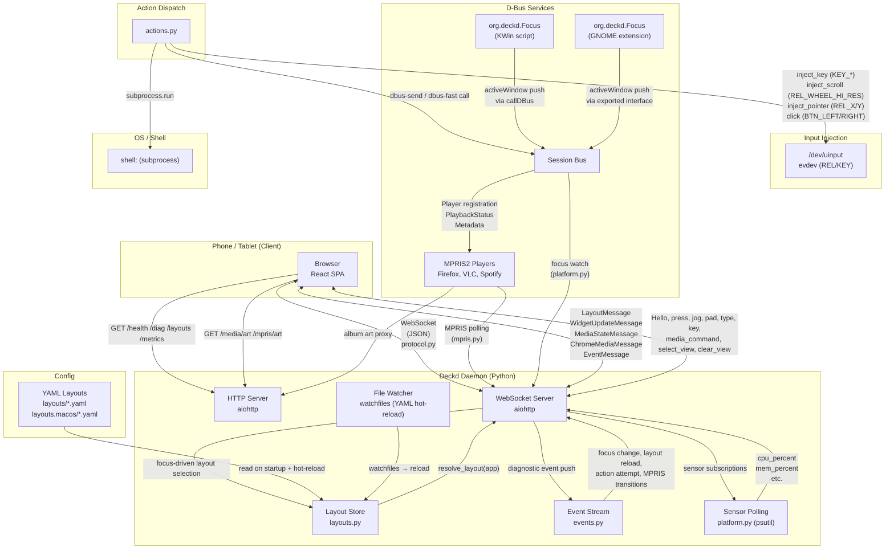

# Architecture

This document combines the system architecture diagram and the documentation index. The diagram is a [Mermaid](https://mermaid.js.org/) block — text-based, version-controlled, and renderable by any Mermaid viewer (GitHub, `mermaid-cli`, browser extension).

For a navigation map and onboarding guide, see [ONBOARDING.md](ONBOARDING.md).

## System diagram

<!--
  Render with:  npx -p @mermaid-js/mermaid-cli mmdc -i docs/ARCHITECTURE.md -o docs/architecture.png
  The --preview option shows it live in a browser tab.
-->

## Key flows

1. **Layout push**: Client connects via WebSocket → daemon resolves focused app → pushes `LayoutMessage` with widget grid, app badge, chrome settings. When focus changes (platform backend detects new `AppInfo`), daemon pushes a new `LayoutMessage`.

2. **Button press**: Client sends `press {id}` → daemon looks up widget by id in active layout → dispatches action (key, shell, dbus, terminal) via `actions.py`.

3. **Scroll strip**: Client sends `jog {id, delta}` on drag → daemon emits `REL_WHEEL_HI_RES` via `/dev/uinput`. On release, client sends `jog_end {id, velocity}` → daemon runs momentum decay loop.

4. **Manual control**: Client sends `pad`, `pad_tap`, `pad_drag` → daemon translates to `REL_X/Y`, `BTN_LEFT/RIGHT`. Client sends `type` / `key` → daemon injects keystrokes via `/dev/uinput`. Feedback-loop guard: daemon drops keyboard input while its own client window is focused.

5. **MPRIS media**: Daemon polls session bus for `org.mpris.MediaPlayer2` players → pushes `ChromeMediaMessage` (passive playback indicator) and `MediaStateMessage` (per-player state) to connected sessions. Album art is proxied through HTTP routes (`/mpris/{name}/art`).

6. **VLC media**: Daemon polls VLC's HTTP API (subpath of `/media/...`) → pushes `MediaStateMessage` with VLC-specific state. Art is proxied through `/media/{id}/art`.

7. **Live meters/stats**: Daemon polls `SensorSource` instances (e.g. `cpu_percent` via psutil) → pushes `WidgetUpdateMessage` to sessions that have meter/stats widgets in their active layout.

8. **Hot-reload**: `watchfiles` monitors the layouts directory → on any `.yaml` write, re-loads all layouts, resolves current focus → pushes new `LayoutMessage` to every connected session. Invalid YAML pushes `LayoutMessage` with `error` set (last-good layouts stay live).

9. **Diagnostic events**: Client sends `enable_events` → daemon pushes `EventMessage` frames for focus changes, layout reloads, action outcomes, auth events, and MPRIS transitions. Event stream is per-session and opt-in.

## Documentation index

| What | Where | Description |
|---|---|---|
| **Domain vocabulary** | [CONTEXT.md](../CONTEXT.md) | Ubiquitous language; defines Layout, Widget, Chrome, Action, AppInfo, Match, Bind, etc. |
| **Operational reference** | [REFERENCE.md](REFERENCE.md) | Canonical CLI flags, env vars, diagnostic endpoints, project status. |
| **Product intent** | [INCEPTION.md](INCEPTION.md) | Pre-implementation design: architecture, core principles, v1 scope, deferred work. |
| **ADR index** | [adr/README.md](adr/README.md) | All architecture decisions with summaries and amend/supersede relationships. |
| **Spike tracker** | [SPIKES.md](SPIKES.md) | Spike progress and implementation plan (de-risking work). |
| **KDE focus investigation** | [spike-kde-wayland-focus.md](spike-kde-wayland-focus.md) | KWin/Wayland focus detection paths investigated. |
| **Research** | [research/](research/) | Research notes (Stream Deck built-in actions catalog, etc.). |
| **Agent workflows** | [agents/](agents/) | Issue tracker conventions, triage labels, domain doc consumption. |
| **Onboarding** | [ONBOARDING.md](ONBOARDING.md) | Repository map, read order, protocol locations, development modes, verification ladder. |
| **Wire protocol (Python)** | [daemon/deckd/protocol.py](../daemon/deckd/protocol.py) | Executable contract: all `ServerMessage` and `ClientMessage` types. |
| **Wire protocol (TypeScript)** | [client/src/protocol.ts](../client/src/protocol.ts) | TypeScript mirror of the wire protocol. |
| **Layout schema** | [daemon/deckd/layouts.py](../daemon/deckd/layouts.py) | Pydantic models for Layout, Widget, Action, Icon, MediaHttp. |
| **HTTP/WS routes** | [daemon/deckd/server.py](../daemon/deckd/server.py) | All HTTP endpoints and WebSocket dispatch. |
| **Platform backend** | [daemon/deckd/platform.py](../daemon/deckd/platform.py) | `PlatformBackend` Protocol: focus watching, input injection, sensor sources. |
| **Daemon CLI** | [daemon/deckd/__main__.py](../daemon/deckd/__main__.py) | Argparse: --layouts-dir, --client-dist, --bind, --no-auth, --verbose. |
| **deckctl CLI** | [daemon/deckd/cli.py](../daemon/deckd/cli.py) | status, reload, layout, metrics subcommands. |
| **Build/test commands** | [Justfile](../Justfile) | All common commands: setup, dev, test, build, smoke. |
| **README** | [README.md](../README.md) | Human-facing: pitch, screenshots, status, setup, config reference. |

## Code owns behavior

Prose documentation describes intent, vocabulary, and decisions. It does not duplicate:

- **Endpoint paths and parameters** — see `daemon/deckd/server.py` for routes.
- **Flag names and defaults** — see `daemon/deckd/__main__.py` for argparse definitions; the running daemon is self-documenting via `--help`.
- **Wire message shapes** — see `daemon/deckd/protocol.py` for the executable Pydantic models (`ServerMessage`, `ClientMessage`, and all their variants).
- **Layout field validation** — see `daemon/deckd/layouts.py` for the Pydantic models (`Layout`, `Widget`, `Action`). Valid YAML is whatever passes `Layout.model_validate()`.
- **Action dispatch behavior** — see `daemon/deckd/actions.py`. Available primitives are `key`, `shell`, `dbus`, `terminal`, `url`, and `text`.

When in doubt, read the code. Tests (`tests/`) are the next best source — they exercise the public interfaces at the agreed seams.
